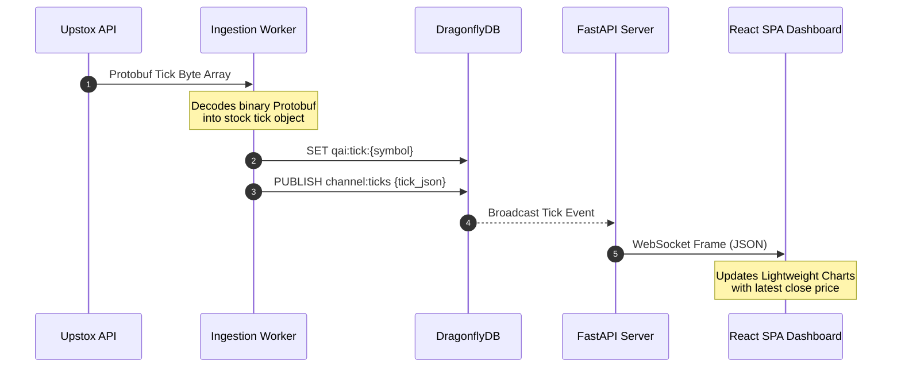
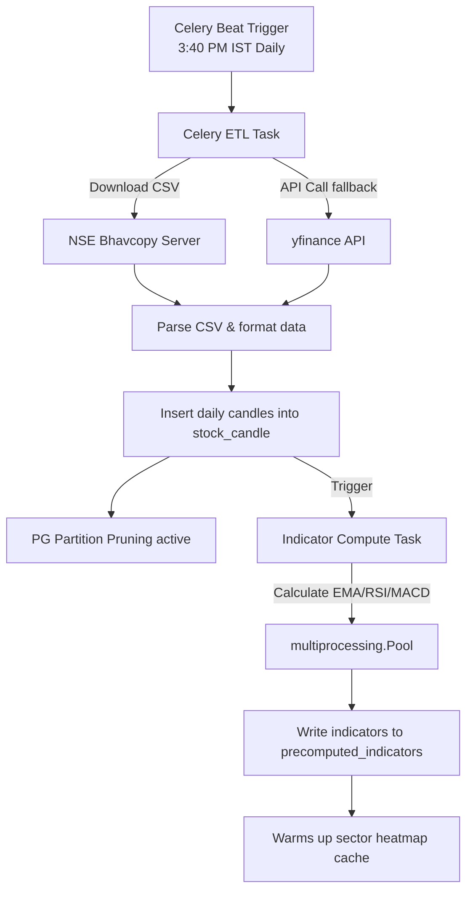
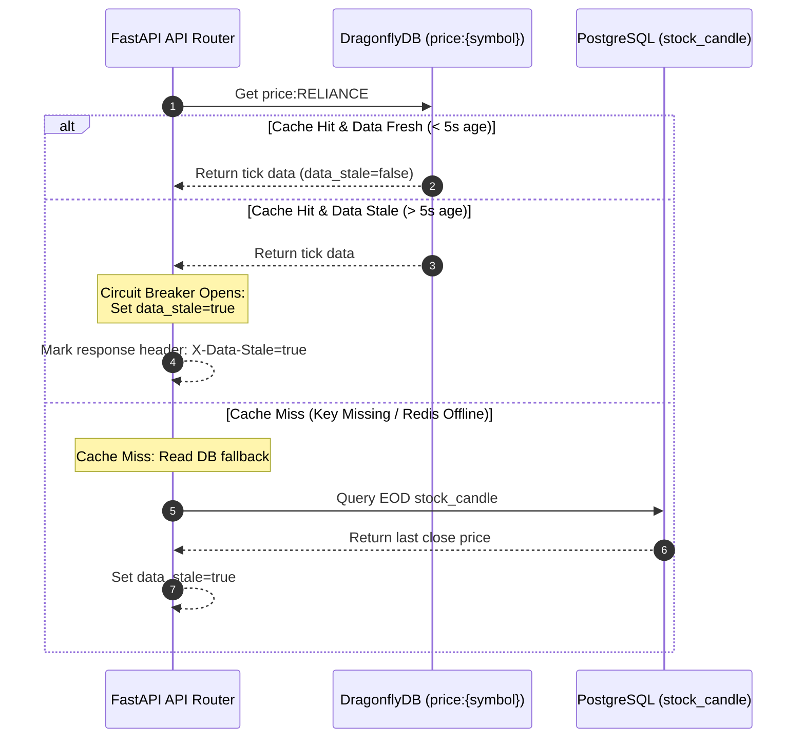

# QuantAI India: Consolidated Technical Architecture & Event-Driven Redesign Specification

This document serves as the master technical specification and architectural review for the QuantAI India AI-powered trading, backtesting, and market analytics platform. It consolidates the 12 modular documentation sections, system diagrams, and contains the complete specification for migrating the platform to a low-latency, event-driven, cache-first architecture powered by Apache Kafka and DragonflyDB.

---

## Table of Contents
1. [System Overview](#1-system-overview)
2. [Technology Stack](#2-technology-stack)
3. [Frontend Architecture](#3-frontend-architecture)
4. [Backend Architecture](#4-backend-architecture)
5. [Database Design & Schema](#5-database-design--schema)
6. [API Documentation & Inventory](#6-api-documentation--inventory)
7. [Data Flow Analysis](#7-data-flow-analysis)
8. [Security Review & Risks](#8-security-review--risks)
9. [Performance Review & Optimizations](#9-performance-review--optimizations)
10. [Scalability Review & Roadmap](#10-scalability-review--roadmap)
11. [Deployment Architecture](#11-deployment-architecture)
12. [Technical Debt Report](#12-technical-debt-report)
13. [Core System Diagrams](#13-core-system-diagrams)
14. [Event-Driven Architecture Refactoring Plan (Kafka & Dragonfly)](#14-event-driven-architecture-refactoring-plan-kafka--dragonfly)

---

## 1. System Overview

QuantAI India is a production-grade, AI-powered professional trading, backtesting, and analytics platform designed specifically for the National Stock Exchange (NSE) of India. It enables retail traders and quantitative analysts to build, test, and run Smart Beta Multi-Factor trading models, utilize technical scanners (such as VCP, Darvas Box, and volume profile), trace institutional flows (FII/DII block deals), and stream live market data.

### Business Domain
- **Geography**: Indian stock markets (primarily NSE).
- **Core Verticals**: Factor investing, backtesting simulation, and algorithmic technical scanning.

### User Personas
1. **Retail Active Trader**: Uses the web application to screen momentum stocks, track institutional block deals, review volatility indicators, and consult the AI-advisor for trading setups.
2. **Quantitative Analyst (Quant)**: Develops custom factor models, executes walk-forward optimizations, runs backtests across 20-year daily datasets, and tests machine learning strategies.
3. **SaaS Premium Subscriber**: Enrolls in the Learning Academy (courses, quizzes) and accesses premium AI-generated research newsletters and portfolio intelligence recommendations.

### Main Features
- **Real-Time Market Ingestion**: Low-latency WebSocket integration with Upstox API using binary Protobuf streaming.
- **Factor & Strategy Backtester**: Bar-by-bar historical backtesting simulator supporting multi-factor strategies and walk-forward parameter optimization.
- **Technical & Institutional Scanners**: Heavy-duty algorithms scanning Nifty 500 stocks for volatility contraction patterns (VCP), Darvas Box breakouts, volume profiles, and FII block deals.
- **AI-Powered Analytics**: Conversational prompt interface utilizing the Google Gemini API to analyze market trends, scan stocks, and generate custom trade setups.
- **SaaS Ecosystem**: Integration of Razorpay subscriptions, affiliate broker commission tracking, and a built-in educational Learning Academy.

---

## 2. Technology Stack

The platform utilizes a modern, containerized stack designed for low-latency market data processing and heavy numerical compute.

### Tech Stack Matrix

| Layer | Technology | Version | Purpose / Role |
| :--- | :--- | :--- | :--- |
| **Frontend Framework** | React | `^19.2.0` | User interface structure and page components |
| **Build Tooling** | Vite | `^6.2.0` | Fast development server and production builds |
| **Language** | TypeScript | `~5.8.2` | Static type safety across components and APIs |
| **Styling** | Tailwind CSS | `^3.4.17` | Premium modern utility-first CSS styling |
| **State Management** | React Context + Query | `^5.101.0` | Global state (Auth, symbols) + server-cache state |
| **Data Fetching** | Fetch API | Native | Promise-based request wrapper with custom retry/timeout |
| **Charts & Visuals** | Recharts / Lightweight Charts | `^3.4.1` / `4.1.1` | Financial stock charts, equity curves, drawdown distribution |
| **Authentication** | Firebase Client SDK | `^12.7.0` | SSO, Google/Email authentication |
| **Backend Framework** | FastAPI | `^0.110.0` | High-performance ASGI web framework, automatic OpenAPI |
| **Task Queue** | Celery | `^5.3.0` | Asynchronous backtesting and ETL worker |
| **Web Server** | Uvicorn | `^0.28.0` | ASGI server implementation, running multi-workers |
| **Database ORM** | SQLAlchemy | `^2.0.0` | Database schema mapping and connection pooling |
| **Async Driver** | asyncpg | `^0.29.0` | Low-level asynchronous database driver for Postgres |
| **Data Analysis** | Pandas / Numpy | `^2.2.0` | Dataframe manipulation and numerical vector math |
| **Local Analytics** | DuckDB | `^0.10.0` | In-memory vectorized DB for local feature store queries |
| **HTTP Client** | HTTPX | `^0.27.0` | Asynchronous HTTP client for external API requests |
| **AI Integration** | Google GenAI SDK | `^1.30.0` | Large language model prompts (Gemini API) |
| **Primary Database** | PostgreSQL | `16` | Relational storage for users, orders, settings, and metrics |
| **Connection Pooler**| PgBouncer | `1.21` | Connection pooling to avoid DB connection exhaustion |
| **In-Memory Cache** | DragonflyDB | `latest` | Redis-compatible cache & task broker (up to 25x faster) |
| **Data Warehouse** | Parquet | Columnar | Local file-based Hive-partitioned warehouse for ticks |
| **Container Engine** | Docker / Compose | `v2` | Service containerization and process isolation |
| **Observability** | Prometheus / Grafana | `latest` | Metrics collection and dashboard visualization |
| **Redis Metrics** | Redis-exporter | `latest` | Exporter bridging Dragonfly stats into Prometheus |

---

## 3. Frontend Architecture

The frontend is a TypeScript SPA built with React, Vite, and Tailwind CSS.

### Pages & Routes Inventory

| Route | Page | APIs Consumed |
| :--- | :--- | :--- |
| `/` | `LandingPage` | None (Public Static) |
| `/login` / `/signup` | `Login` / `Signup` | `/api/auth/firebase-login`, `/api/auth/signup` |
| `/dashboard` | `Dashboard` | `/api/trading/stats`, `/api/trading/market-indices`, `/api/trading/top-gainers` |
| `/ai-prompt` | `AIPrompt` | `/api/ai/prompt` |
| `/scanner` | `Scanner` | `/api/scanner/active` |
| `/sector-heatmap` | `SectorHeatmapPage` | `/api/heatmap?mode={mode}&timeframe={tf}` |
| `/sector-analysis`| `SectorAnalysisPage` | `/api/sector-analysis` |
| `/volume-profile` | `VolumeProfilePage` | `/api/volume-profile?symbol={s}` |
| `/volatility` | `VolatilityDashboard`| `/api/volatility/stats` |
| `/option-flow` | `OptionFlow` | `/api/option-flow/sweeps` |
| `/quant-workspace` | `QuantWorkspace` | `/api/workspace/files`, `/api/backtest/run` |
| `/watchlist` | `Watchlist` | `/api/watchlist` |
| `/institutional` | `InstitutionalScanner`| `/api/institutional/flows` |
| `/diagnostics` | `PriceDiagnosticPanel`| `/api/system/health`, `/api/upstox/status` |

### State Management & Performance
- **React Contexts**: Globally broadcasts user auth status (`AuthContext`) and selected active symbols (`GlobalSymbolProvider`) to ensure dashboard consistency.
- **Server Cache state**: Handled via TanStack Query. Cache responses are set to a 3-second TTL.
- **Request Cancellation**: Implements `AbortController` references in local hooks, aborting in-flight HTTP requests when switching symbols or tabs to prevent network bottlenecks.
- **API Client ([api.ts](file:///c:/Users/Deepak%20Kumar/Downloads/quantai-india/frontend/src/services/api.ts))**: Automatically exchanges Firebase JWT for backend Authorization header. Enforces a 30s client-side request timeout.

---

## 4. Backend Architecture

FastAPI acts as the ASGI entry point running via Uvicorn.

### Start-Up Sequences
On application startup, Uvicorn initializes 5 asynchronous fire-and-forget background tasks:
1. **`MarketDataOrchestrator.start()`**: Manages WebSocket tick connections and REST fallbacks.
2. **`start_nifty100_ranking_service()`**: Ranks Nifty 100 stock returns every 30s.
3. **`start_sector_service()`**: Computes sector relative strength trends.
4. **`start_realtime_breakout_service()`**: Monitors 52-week breakouts.
5. **`RealtimeScannerEngine.initialize()`**: Restores and hydrates scanner parameters.

### Caching Strategy (DragonflyDB)
DragonflyDB caches tick streams (`qai:tick:{symbol}`, 60s TTL), indicators (5s TTL), and heatmap requests (30s TTL). In production builds, the client enforces a fail-fast policy without in-memory fallback dicts to avoid silent data corruption.

### Background Task Broker
Celery workers execute backtesting tasks and daily ETL jobs. Prefetch multiplier is restricted to `1` (fair scheduling), and workers are recycled after executing 50 tasks or when reaching 512MB RAM usage to prevent memory leaks.

---

## 5. Database Design & Schema

PostgreSQL houses relational tables, utilizing `asyncpg` for reactive APIs and `psycopg2` for sync background Celery tasks.

### Core Tables

#### 1. `instrument_master`
- Master list of all traded equities.
- Columns: `instrument_id` (BigInteger PK), `instrument_key` (String 100 Unique), `symbol` (String 20 Index), `series` (String 10), `exchange` (String 10), `company_name` (Text), `sector` (Text), `isin_code` (String 20), `is_active` (Boolean).

#### 2. `stock_candle`
- Columnar OHLCV data partitioned monthly on `candle_ts`.
- Columns: `instrument_id` (BigInteger FK), `timeframe` (SmallInteger), `candle_ts` (DateTime), `open` / `high` / `low` / `close` (Numeric 12,4), `volume` (BigInteger).
- Primary Key: Composite `(instrument_id, timeframe, candle_ts)`.

#### 3. `precomputed_indicators`
- Caches pre-calculated indicators updated daily.
- Columns: `symbol` (PK), `interval` (PK), `timestamp` (PK), `rsi_14`, `macd`, `macd_signal`, `momentum_score` (Index).

#### 4. `vcp_scores`
- Persists Volatility Contraction Pattern metrics computed by background screening workers.
- Columns: `symbol` (Unique Index), `current_price` (Float), `vcp_score` (Float), `num_contractions` (Integer), `latest_contraction_pct` (Float), `volume_dry_up_pct` (Float), `breakout_pivot` (Float).

---

## 6. API Documentation & Inventory

### 1. Authentication
- `POST /api/auth/signup`: Creates a new user profile.
- `POST /api/auth/firebase-login`: Exchanges a Firebase SSO JWT for a local session token.

### 2. Market Data
- `GET /api/trading/market-indices`: Fetches quotes for Nifty 50, Bank Nifty, and India VIX.
- `GET /api/heatmap`: Returns sector-grouped, market-cap weighted treemap values. Requires `mode` and `timeframe` query params.
- `GET /api/volume-profile`: Computes Point of Control (POC) and value area bins.

### 3. Backtesting
- `POST /api/backtest/run`: Submits a backtest configuration to Celery. Returns `task_id`.
- `GET /api/backtest/status/{task_id}`: Polls Celery task progress.

---

## 7. Data Flow Analysis

### Real-Time WebSocket Tick Ingestion Flow
```
[Broker API (Upstox)] ──(Protobuf bytes)──> [Ingestion Worker]
                                                   │ (Decodes)
                                                   ▼
[DragonflyDB Cache] <──(Pub/Sub broadcast)── [SET key]
        │
        └─────> [FastAPI Server] ──(WS JSON frame)──> [React Chart]
```

### End-Of-Day (EOD) Ingestion Flow
```
[Celery Beat Schedule] ──(3:40 PM IST)──> [Celery Worker]
                                                   │
           ┌──────────────────────────────────────┴──────────────────────────────────────┐
           ▼                                                                             ▼
[Parse NSE Bhavcopy CSV]                                                      [Download yfinance fallback]
           │                                                                             │
           └──────────────────────────────────────┬──────────────────────────────────────┘
                                                  ▼
                                       [Insert stock_candle]
                                                  │
                                                  ▼
                                   [Precompute indicators task]
                                                  │
                                                  ▼
                                    [precomputed_indicators Table]
```

---

## 8. Security Review & Risks

### Encryption Context
Broker API access tokens are stored in the database under `BrokerCredentials` using Fernet symmetric encryption. The column is mapped to `EncryptedString` in [database.py](file:///c:/Users/Deepak%20Kumar/Downloads/quantai-india/backend/database.py) using `TOKEN_ENCRYPTION_KEY` from the environment.

### Security Vulnerability Register

| # | Vulnerability | Severity | Impact | Mitigation Plan |
| :-: | :--- | :---: | :--- | :--- |
| 1 | **SQL Injection in Feature Store** | **CRITICAL** | Dynamic f-string SQL building in `feature_store.py:93`. | Parameterize DuckDB symbol queries. |
| 2 | **Permissive CORS Settings** | **HIGH** | `allow_origins=["*"]` allows any site to query API. | Restrict allowed origins to specific domains. |
| 3 | **Arbitrary Code Execution** | **HIGH** | loading pickled ML ensembles via `joblib.load()`. | Transition to `safetensors` or ONNX. |
| 4 | **Hardcoded Plaintext Secrets** | **MEDIUM** | DB and Grafana admin passwords in compose file. | Implement Docker Secrets / Vault. |

---

## 9. Performance Review & Optimizations

### 1. Market Indices Timeout Resolved
- **Vulnerability**: yfinance fallback took up to 15s to time out inside Docker when blocked, blocking the REST thread and causing the client to abort.
- **Fix**: Reduced yfinance download timeout to `2.5s` and wrapped Upstox/yfinance calls in `asyncio.wait_for` (timeouts `3.5s` and `3.0s`).

### 2. Sector Heatmap Partition Pruning Deployed
- **Vulnerability**: Heatmap queries performed a full table scan on partitioned `stock_candle` table because of missing `candle_ts` filters.
- **Fix**: Added dynamic `cutoff_date` calculation based on the database's maximum candle date. Injected `AND candle_ts >= :cutoff_date` to prune partitions and force index-scans, dropping latency from >30s to **24.7ms**.

### 3. Parallel Live Hydration Deployed
- **Vulnerability**: Heatmap enriches 438 stocks with live prices in sequential batches, taking 1.8 seconds.
- **Fix**: Parallelized batch HTTP requests using `asyncio.gather` with a 3.5s fallback timeout.

---

## 10. Scalability Review & Roadmap

### Phase 1: 10,000 Concurrent Users
- Enable **PgBouncer** connection pooling in transaction mode.
- Set up **PostgreSQL Read Replicas** for read-only routes (`/api/heatmap`, `/api/scanner`).

### Phase 2: 100,000 Concurrent Users
- Migrate from Docker Compose to **Kubernetes** with HPAs (Horizontal Pod Autoscaler) scaling FastAPI instances.
- Partition PostgreSQL `stock_candle` tables by `timeframe` range.

### Phase 3: 1,000,000 Concurrent Users
- Implement horizontal database sharding using **TimescaleDB / Citus** nodes.
- Route live broker ticks to an **Apache Kafka** cluster, feeding parallel worker pipelines.
- Store historical columnar tick records on S3/GCS using **Apache Iceberg** tables.

---

## 11. Deployment Architecture

Local development uses Docker Compose with 7 core containers.

```
                  ┌───────────────────────────────┐
                  │      Nginx Reverse Proxy      │
                  │      (quantai-frontend:80)    │
                  └───────────────┬───────────────┘
          ┌───────────────────────┴───────────────────────┐
          ▼                                               ▼
┌──────────────────┐                            ┌──────────────────┐
│   FastAPI API    │                            │ Prometheus/Graf. │
│ (backend:8000)   │                            │ (Metrics visual) │
└─────────┬────────┘                            └─────────┬────────┘
          ├───────────────────────────────────────────────┤
          ▼                                               ▼
┌──────────────────┐                            ┌──────────────────┐
│  DragonflyDB     │                            │ Celery Workers   │
│ (Cache/Broker)   │                            │ (quantai-worker) │
└─────────┬────────┘                            └─────────┬────────┘
          ▼
┌──────────────────┐
│ PostgreSQL DB    │
│  (Database)      │
└──────────────────┘
```

---

## 12. Technical Debt Report

### 1. Duplicated Backtest Engines (Severity: `CRITICAL`)
The codebase contains four distinct backtesting engines, which creates severe maintenance risk. Slip, commission, and portfolio margin adjustments must be synchronized in four files.
*Action*: Unify into `core/backtest/engine.py` and delete duplicate implementations.

### 2. ML Pipeline Subprocess Execution (Severity: `HIGH`)
ML model training is launched using local `subprocess.Popen` commands, communicating job state via a local `ml_status.json` file. This breaks in multi-container replica clusters.
*Action*: Migrate training calls to Celery background tasks with job state persisted in DragonflyDB.

---

## 13. Core System Diagrams

### High-Level System Topology

```mermaid
graph TB
    subgraph Client ["Client Tier"]
        ReactDashboard["React Web App<br/>(Vite / TS)"]
    end

    subgraph API ["API & Gateway Tier"]
        NginxGateway["Nginx Reverse Proxy<br/>(Port 3000 -> 80)"]
        FastAPI["FastAPI Web Server<br/>(Uvicorn Workers)"]
    end

    subgraph Cache ["Caching & Broker Tier"]
        Dragonfly["DragonflyDB<br/>(Redis-compatible Cache & Broker)"]
    end

    subgraph Worker ["Worker & Background Tier"]
        CeleryWorker["Celery Worker Pool<br/>(Backtests, Bot, Indicators)"]
        IngestionWorker["Upstox Ingestor<br/>(WS Streaming Ticks)"]
    end

    subgraph Data ["Data & Storage Tier"]
        Postgres[("PostgreSQL DB<br/>(Primary & Replica)")]
        Parquet[("Parquet Warehouse<br/>(Columnar Tick Store)")]
    end

    subgraph External ["External Services"]
        UpstoxAPI["Upstox API<br/>(REST & WebSocket)"]
        Firebase["Firebase Auth SSO"]
    end

    ReactDashboard -->|1. HTTPS Request| NginxGateway
    NginxGateway -->|2. Reverse Proxy| FastAPI
    FastAPI -->|3. Read/Write State| Postgres
    FastAPI -->|4. Authenticate JWT| Firebase
    FastAPI -->|5. Read Cache / Enqueue Task| Dragonfly
    Dragonfly -->|6. Dequeue Task| CeleryWorker
    CeleryWorker -->|7. Query / Save Results| Postgres
    CeleryWorker -->|8. Load Columnar Data| Parquet

    UpstoxAPI -->|9. Stream ticks (Protobuf)| IngestionWorker
    IngestionWorker -->|10. Buffer & Publish ticks| Dragonfly
    FastAPI <-->|11. Real-time WS connection| ReactDashboard
```

### Real-Time WebSocket Streaming Sequence



### Background ETL Ingestion Flow



---

## 14. Event-Driven Architecture Refactoring Plan (Kafka & Dragonfly)

To meet the requirements of zero runtime Upstox REST API dependency on user-facing requests and support 50,000+ concurrent users, we propose transitioning QuantAI India to an asynchronous, Event-Driven Architecture (EDA).

### 14.1 System Architecture Topology

The refactored architecture decouples tick ingestion from API runtimes via Apache Kafka, storing all intermediate state in DragonflyDB and PostgreSQL.

```
                                  ┌───────────────────────────────┐
                                  │      Upstox Market Feed       │
                                  │      (Binary Protobuf WS)     │
                                  └───────────────┬───────────────┘
                                                  │
                                                  ▼
                                  ┌───────────────────────────────┐
                                  │     Market Feed Service       │
                                  │  - Auto Reconnect & Heartbeat │
                                  │  - Protobuf Tick Decoder      │
                                  │  - Kafka Producer             │
                                  └───────────────┬───────────────┘
                                                  │
                                                  ▼ (Publish)
                                    [Apache Kafka Topic: ticks.raw]
                                                  │
                                                  ├──────────────────────────────┐
                                                  ▼                              ▼
                                      ┌───────────────────────┐      ┌───────────────────────┐
                                      │     PriceConsumer     │      │   IndicatorConsumer   │
                                      │ - Hydrates ticks      │      │ - Calculates EMA/RSI  │
                                      │ - Publishes processed │      │ - Publishes processed │
                                      └───────────┬───────────┘      └───────────┬───────────┘
                                                  │                                  │
                                                  ▼ (SET price:{symbol})             ▼ (Publish signals)
                                        ┌──────────────────┐              [Kafka: signals.breakout]
                                        │   DragonflyDB    │              [Kafka: signals.vcp]
                                        │  (Cache Store)   │              [Kafka: signals.momentum]
                                        └─────────┬────────┘                         │
                                                  ▲                                  ▼
                                                  │ (Reads cached prices)     ┌──────────────┐
                                                  │                           │  PostgreSQL  │
                                        ┌─────────┴────────┐                  │  (Database)  │
                                        │   FastAPI APIs   │                  └──────────────┘
                                        │ (Zero Upstox REST)│
                                        └──────────────────┘
```

---

### 14.2 Detailed Component Specification

#### A. New Dedicated Service: `backend/services/market_feed_service/`
This service acts as the boundary node for external broker ingestion. It runs inside an isolated docker container (`quantai-market-feed`).
- **Websocket Supervision**: Establishes connection to `wss://api.upstox.com/v2/feed/market-data-feed` using the 1-year Analytics Token.
- **Heartbeat & Resiliency**: Listens for ping/pong frames. If a heartbeat is missed for 5 seconds, it forcefully disconnects, triggers exponential backoff reconnect logic (reconnect limits: infinite, starting at 1s, doubling to maximum 30s).
- **Decoder Node**: Extracts binary byte streams, parses them into Python dictionaries utilizing compiled Upstox protobuf definitions (`decode_market_data`).
- **Kafka Producer**: Broadcasts the decoded dictionary into Kafka topic `ticks.raw`.

#### B. Apache Kafka Topics Topology
We introduce 6 structured event topics with partition limits optimized for horizontal scaling (e.g. 10 partitions per topic, keyed by stock symbol to guarantee in-order delivery per stock):
1. **`ticks.raw`**: Ingests raw decoded ticks from the Market Feed Service.
2. **`ticks.processed`**: Ingests enriched ticks (incorporating historical ratios, daily change pct).
3. **`signals.breakout`**: Event-stream of breakout conditions (e.g., VCP breakouts, 52-week breakouts).
4. **`signals.vcp`**: Volatility contraction waves updates.
5. **`signals.momentum`**: High-momentum signal crosses.
6. **`sector.performance`**: Aggregated performance weights calculated in rolling windows.

#### C. Kafka Consumers
Kafka consumers run as independent daemon loops:
1. **`PriceConsumer`**:
   - Subscribes to `ticks.raw`.
   - Formats prices into standardized schemas.
   - Writes values directly to DragonflyDB using key format `price:{symbol}`.
   - Triggers Dragonfly Pub/Sub channel broadcasts for active WebSocket subscribers.
2. **`IndicatorConsumer`**:
   - Subscribes to `ticks.raw`.
   - Maintained in-memory ring buffers of past closes.
   - Computes sub-minute indicators (e.g., EMA cross, RSI ticks).
   - Publishes triggers to `signals.*` topics.
3. **`SectorConsumer`**:
   - Subscribes to `ticks.processed`.
   - Aggregates percentage change weighted by market capitalization in 10s intervals.
   - Publishes sector matrices to `sector.performance` and DragonflyDB keys.
4. **`ScannerConsumer`**:
   - Subscribes to `signals.*` and `ticks.processed`.
   - Aggregates and filters symbols meeting scanner parameters.
   - Writes scanner triggers to PostgreSQL database and caches results in DragonflyDB.

#### D. Dragonfly Price Schema (`price:{symbol}`)
Each symbol ticker writes to a Redis hash structure:
```json
{
  "symbol": "RELIANCE",
  "ltp": 2425.65,
  "volume": 4209500,
  "change_percent": 1.45,
  "timestamp": 1782012034000
}
```
*Note: Key lifetime (TTL) is set to `86400` seconds (1 day) to survive intraday resets. It is refreshed on every tick. The connection client uses pipeline batch writes to minimize latency.*

---

### 14.3 API Decoupling Contract
All API routes are modified to query only DragonflyDB and PostgreSQL, completely removing HTTPX and Upstox REST connections from endpoints.

#### 1. Market Indices API (`/api/trading/market-indices`)
- **Action**: Queries DragonflyDB keys `price:NIFTY_50`, `price:BANK_NIFTY`, `price:INDIA_VIX`.
- **Fallback**: If keys are missing, queries PostgreSQL EOD candles from `stock_candle` table. Never calls Upstox REST or yfinance.

#### 2. Heatmap API (`/api/heatmap`)
- **Action**: Queries the DB for the static baseline list of Nifty 500 stocks. Fetches active prices in a single pipelines MGET request from Dragonfly (`price:{symbol}`).
- **Fallback**: If Dragonfly returns null, falls back to the database `latest_close`.

#### 3. Watchlist API (`/api/watchlist`)
- **Action**: Performs a single Dragonfly `MGET` request for the watchlist items. If addition requires baseline price, query `stock_candle` database instead of Upstox historical REST.

#### 4. Option Flow & Chain APIs (`/api/option-flow/*`)
- **Action**: Fetch active contracts and option sweeps from PostgreSQL tables populated by background workers, and live quote indicators from DragonflyDB.

---

### 14.4 Resilience & Circuit Breaker Logic
We deploy a client-side circuit breaker inside `UpstoxPriceResolver` to handle Market Feed Service disconnects or Kafka consumer lag.



- **Staleness Threshold**: Ticks with `timestamp` older than `5.0` seconds are automatically marked as `data_stale=true` in the API response.
- **Fail-Safe Contract**: APIs must NEVER raise an Exception or timeout when Upstox is disconnected; they return the last cached price with `data_stale=true` or EOD database fallback.

---

### 14.5 Real-Time WebSocket Broadcast Architecture
We establish a reactive tick broadcasting channel:
1. Ticks processed by `PriceConsumer` trigger:
   `redis.publish("market:ticks:broadcast", tick_json)`
2. FastAPI runs a background subscription loop:
   ```python
   async def websocket_endpoint(websocket: WebSocket):
       await websocket.accept()
       pubsub = redis.pubsub()
       await pubsub.subscribe("market:ticks:broadcast")
       async for message in pubsub.listen():
           if message['type'] == 'message':
               await websocket.send_text(message['data'])
   ```
3. React UI listens to this WebSocket connection and updates the charts dynamically without REST queries.

---

### 14.6 Prometheus metrics definition
We introduce five core Prometheus metrics:
1. `upstox_connection_status` (Gauge): `1` if websocket is connected, `0` if disconnected.
2. `tick_latency_ms` (Histogram): End-to-end latency from Upstox exchange timestamp to Dragonfly cache write.
3. `kafka_lag` (Gauge): Delta between Kafka partition log end offset and current consumer group offset.
4. `cache_hit_rate` (Summary): Ratio of API requests resolved via DragonflyDB vs PostgreSQL.
5. `stale_symbol_count` (Gauge): Count of symbols where latest tick timestamp exceeds the 5s threshold.

---

### 14.7 Database Migration & TimescaleDB Plan
As we scale real-time tick counts, standard PostgreSQL monthly partitioning will become a write bottleneck.
- **Action**: Convert `stock_candle` to a TimescaleDB hypertable:
  `SELECT create_hypertable('stock_candle', 'candle_ts', chunk_time_interval => INTERVAL '7 days');`
- **Compression**: Enable compression on candles older than 14 days:
  `ALTER TABLE stock_candle SET (timescaledb.compress, timescaledb.compress_segmentby = 'instrument_id');`
  `SELECT add_compression_policy('stock_candle', INTERVAL '14 days');`
  This reduces historical disk footprint by up to 90% and keeps memory usage flat.

---

### 14.8 Implementation Roadmap

#### Phase 1: Standalone Feed Service & Docker Integration (Duration: 5 Days)
- Create `backend/services/market_feed_service/`.
- Implement Upstox WebSocket subscriber with auto-reconnect and heartbeat loop.
- Compile protobuf schemas and verify message parsing.
- Deploy isolated container `quantai-market-feed` in `docker-compose.yml`.

#### Phase 2: Kafka Cluster Deployment & Producers/Consumers (Duration: 7 Days)
- Add Kafka (Zookeeper-less KRaft mode) to `docker-compose.yml` (`wurstmeister/kafka` or `confluentinc/cp-kafka`).
- Add `aiokafka` to `requirements.txt`.
- Develop `ticks.raw` producer inside `MarketFeedService`.
- Implement consumer daemons (`PriceConsumer`, `IndicatorConsumer`) using Python `asyncio` task groups.

#### Phase 3: Cache-First API refactoring & Circuit Breaker (Duration: 6 Days)
- Refactor `UpstoxPriceResolver` to eliminate all direct REST HTTP callouts.
- Modify `/api/trading/*`, `/api/scanner/*`, and `/api/heatmap/*` to resolve quotes via Dragonfly `MGET`.
- Implement circuit breaker logic to return `data_stale=true` on stale Redis cache hits.
- Add database-first fallback query mappings inside resolvers.

#### Phase 4: TimescaleDB Migration & Performance Audit (Duration: 4 Days)
- Write migration script to initialize TimescaleDB extension in PostgreSQL.
- Convert `stock_candle` and create hypertable schema.
- Apply compression policies and optimize composite indexes.

#### Phase 5: WebSocket Broadcast & Prometheus Dashboard (Duration: 5 Days)
- Create FastAPI WebSocket broadcast endpoints subscribing to Dragonfly PubSub.
- Update React dashboard components to establish WebSocket subscription channels instead of REST polling.
- Bind Prometheus metrics in API middlewares and export metrics.
- Build Grafana dashboard displaying Kafka lag, cache hits, and tick latency.
