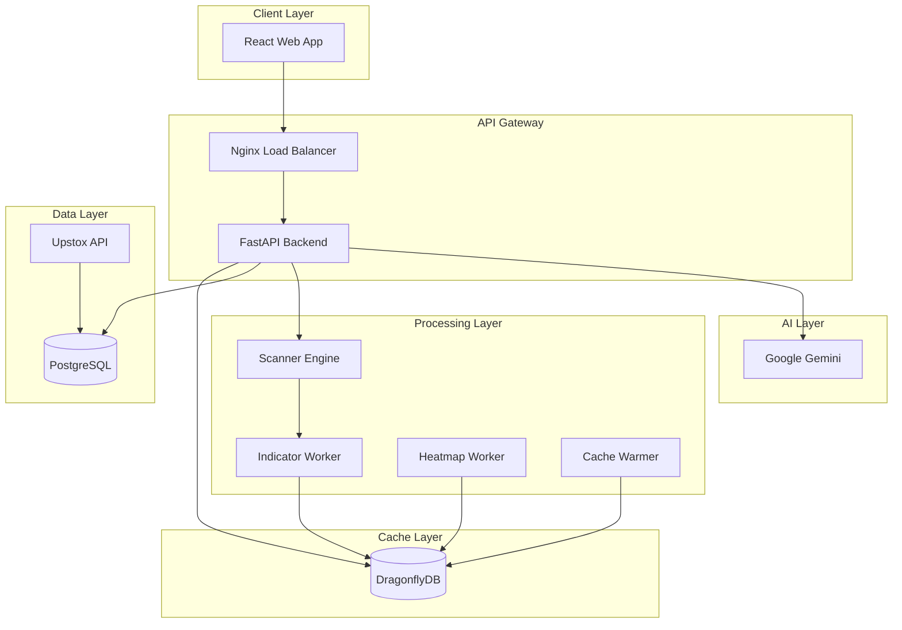
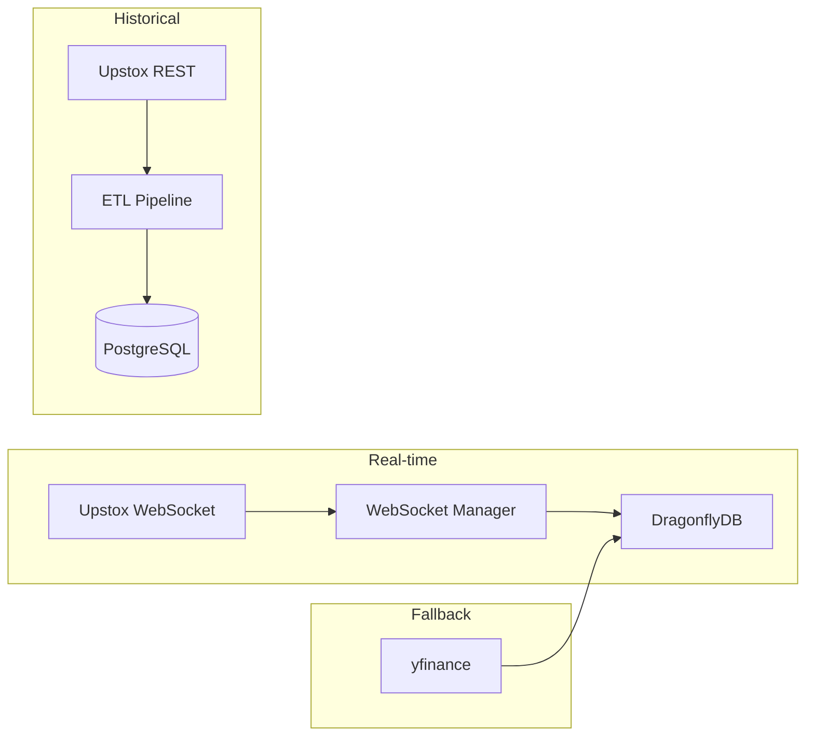
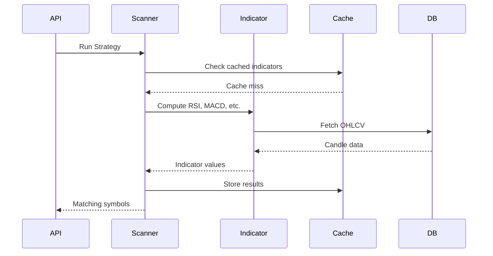

# QuantAI Technical Architecture Document

## Goal
Create comprehensive technical architecture documentation for QuantAI - a scalable, low-latency stock analysis platform for Indian equities (NSE/BSE).

---

## 1. High-Level System Overview

### Logical Architecture



### Component Responsibilities

| Component | Responsibility |
|-----------|---------------|
| **Nginx** | Load balancing, SSL termination, static assets |
| **FastAPI** | REST/WebSocket API, request validation, auth |
| **DragonflyDB** | High-performance caching (Redis-compatible) |
| **PostgreSQL** | Persistent storage for OHLCV, user data, results |
| **Scanner Engine** | Strategy execution, stock screening |
| **Workers** | Background indicator computation, heatmap aggregation |
| **ETL** | Historical data ingestion from Upstox API |
| **Gemini AI** | Natural language analysis, sentiment, recommendations |

### Data Flow

**Synchronous Path:**
```
User Request → Nginx → FastAPI → Cache Check → DB Query → Response
```

**Asynchronous Path:**
```
ETL Job → Upstox API → PostgreSQL → Indicator Worker → DragonflyDB
```

---

## 2. Frontend Architecture (React)

### Component Hierarchy

```
App
├── AuthProvider (Context)
├── ThemeProvider
├── Layout
│   ├── Navbar
│   ├── Sidebar
│   └── MainContent
│       ├── Dashboard
│       │   ├── TopMovers (NIFTY 100)
│       │   ├── SectorHeatmap
│       │   └── QuickStats
│       ├── Scanner
│       │   ├── StrategySelector
│       │   ├── SymbolSearch
│       │   └── ResultsTable
│       ├── Charts
│       │   ├── CandlestickChart
│       │   └── IndicatorOverlays
│       └── AIAssistant
```

### State Management Strategy

| State Type | Strategy | Example |
|------------|----------|---------|
| **Global** | React Context | Auth, Theme, User Preferences |
| **Server** | React Query | API data with caching |
| **Local** | useState/useReducer | Form state, UI toggles |

### API Interaction Layer

```typescript
// services/api.ts
const api = {
  scanner: {
    getStrategies: () => fetch('/api/scanner/strategies'),
    runScan: (params) => fetch('/api/scanner/scan', { method: 'POST', body: params })
  },
  market: {
    getTopMovers: () => fetch('/api/market/top-movers'),
    getHeatmap: () => fetch('/api/heatmap/sectors')
  }
}
```

### Performance Optimizations

- **Debounced Search**: 300ms debounce on symbol search
- **Cached Dropdowns**: Strategy list cached for 5 minutes
- **Lazy Loading**: Route-based code splitting
- **Virtual Scrolling**: For large result tables (>100 rows)

---

## 3. Backend Architecture (API Layer)

### Endpoint Categorization

| Category | Router | Sync/Async | Purpose |
|----------|--------|------------|---------|
| **Market** | `market.py` | Async | Top movers, indices, global markets |
| **Scanner** | `scanner.py` | Async | Strategy execution, screening |
| **Indicators** | `analytics.py` | Async | Technical indicator values |
| **AI** | `ai.py` | Async | LLM-powered analysis |
| **Trading** | `trading.py` | Sync | Order management, portfolio |
| **Auth** | `auth.py` | Sync | JWT authentication |
| **Heatmap** | `heatmap.py` | Async | Sector aggregation |

### Request Flow

```python
# Middleware chain
Request → RateLimiter → AuthMiddleware → ValidationMiddleware → Handler → Response
```

### Timeout Handling

```python
@router.get("/ai/analyze")
async def analyze(symbol: str):
    try:
        result = await asyncio.wait_for(
            gemini_service.analyze(symbol),
            timeout=30.0
        )
    except asyncio.TimeoutError:
        return {"status": "timeout", "fallback": cached_analysis}
```

---

## 4. Market Data Ingestion Layer

### Architecture



### Multi-Timeframe Support

| Timeframe | Window Size | Use Case |
|-----------|-------------|----------|
| `5m` | Month | Intraday scalping |
| `15m` | Month | Swing entry |
| `30m` | Quarter | Position building |
| `1h` | Quarter | Trend confirmation |
| `1d` | Year | Long-term analysis |

### Retry & Deduplication

```python
# ETL with retry logic
MAX_RETRIES = 5
for attempt in range(MAX_RETRIES):
    try:
        response = requests.get(url, headers=headers, timeout=30)
        if response.status_code == 429:
            time.sleep(2 ** attempt)
            continue
        break
    except Exception:
        time.sleep(2 ** attempt)

# Deduplication via ON CONFLICT
INSERT INTO stock_candles (...) VALUES (...)
ON CONFLICT (instrument_key, timeframe, timestamp) DO NOTHING
```

---

## 5. Data Storage Architecture

### PostgreSQL Schema Design

```
stock_candles (PRIMARY)
├── symbol: TEXT
├── instrument_key: TEXT (NSE_EQ|INE...)
├── timeframe: TEXT (1d, 1h, 5m...)
├── timestamp: TIMESTAMP
├── open, high, low, close: REAL
├── volume: REAL
└── PK: (instrument_key, timeframe, timestamp)

stock_master
├── symbol: TEXT (PK)
├── instrument_key: TEXT
├── sector: TEXT
├── market_cap: TEXT
└── is_nifty100: BOOLEAN

users
├── id: UUID (PK)
├── email: TEXT
├── hashed_password: TEXT
└── preferences: JSONB
```

### Indexing Strategy

```sql
-- Optimized for common queries
CREATE INDEX idx_candles_symbol_tf ON stock_candles(symbol, timeframe, timestamp DESC);
CREATE INDEX idx_candles_instrument_tf ON stock_candles(instrument_key, timeframe, timestamp DESC);
CREATE INDEX idx_master_sector ON stock_master(sector);
```

### Hot vs Cold Data

| Data Age | Storage | Access Pattern |
|----------|---------|----------------|
| < 14 days | PostgreSQL + Cache | Frequent, low latency |
| 14d - 1yr | PostgreSQL | On-demand queries |
| > 1yr | Parquet Archive | Batch analysis only |

---

## 6. Caching Architecture (DragonflyDB)

### Cache Key Strategy

```
qai:v1:symbol_master              # All symbols
qai:v1:strategies                 # Strategy definitions
qai:v1:snap:{symbol}              # Real-time price snapshot
qai:v1:ind:{symbol}:{tf}:{name}   # Indicator values
qai:v1:scan:{strategy}:{hash}     # Scan results
qai:v1:ai:{symbol}:{query_hash}   # AI analysis cache
```

### TTL Policies

| Data Type | TTL | Justification |
|-----------|-----|---------------|
| Symbol Master | 24h | Rarely changes |
| Strategy Metadata | 1h | Allow dynamic updates |
| Price Snapshots | 60s | Near real-time accuracy |
| Indicator Values | 15m | Recomputed periodically |
| AI Responses | 1h | Balance freshness/cost |

### Cache Warm-up

```python
# startup.py
async def warmup_cache():
    await cache.set("qai:v1:symbol_master", await db.get_all_symbols())
    await cache.set("qai:v1:strategies", await scanner.get_all_strategies())
    for symbol in NIFTY_100:
        await cache.set(f"qai:v1:snap:{symbol}", await fetch_snapshot(symbol))
```

### Read-Through Pattern

```python
async def get_indicator(symbol, tf, name):
    key = f"qai:v1:ind:{symbol}:{tf}:{name}"
    cached = await dragonfly.get(key)
    if cached:
        return json.loads(cached)
    
    # Cache miss - compute and store
    result = await compute_indicator(symbol, tf, name)
    await dragonfly.setex(key, 900, json.dumps(result))
    return result
```

---

## 7. Indicator & Strategy Engine

### Computation Flow



### Parallelization Strategy

| Task Type | Execution | Tool |
|-----------|-----------|------|
| IO-bound (DB/API) | asyncio.gather | aiohttp, asyncpg |
| CPU-bound (TA) | ProcessPoolExecutor | concurrent.futures |
| Batch jobs | Background workers | asyncio.create_task |

### Strategy Execution

```python
# 21 built-in strategies
STRATEGIES = [
    "rsi_oversold", "macd_crossover", "golden_cross",
    "volume_breakout", "bollinger_squeeze", "52w_high",
    # ... 15 more
]

async def execute_strategy(name: str, symbols: list):
    strategy = STRATEGY_REGISTRY[name]
    tasks = [strategy.evaluate(s) for s in symbols]
    results = await asyncio.gather(*tasks)
    return [r for r in results if r.matches]
```

---

## 8. AI / LLM Integration Layer

### Request Flow

```python
@router.post("/ai/analyze")
async def analyze(request: AnalysisRequest):
    cache_key = f"qai:v1:ai:{request.symbol}:{hash(request.query)}"
    
    # Check cache first
    cached = await dragonfly.get(cache_key)
    if cached:
        return {"source": "cache", "analysis": json.loads(cached)}
    
    # Non-blocking AI call
    try:
        result = await asyncio.wait_for(
            gemini.generate(prompt=build_prompt(request)),
            timeout=30.0
        )
        await dragonfly.setex(cache_key, 3600, json.dumps(result))
        return {"source": "ai", "analysis": result}
    except asyncio.TimeoutError:
        return {"status": "timeout", "fallback": "Analysis unavailable"}
```

### Cost Control

- Cache AI responses for 1 hour
- Limit requests per user: 50/day
- Use smaller model for simple queries
- Batch similar requests when possible

---

## 9. Background Jobs & ETL

### Job Types

| Job | Schedule | Purpose |
|-----|----------|---------|
| **Candle ETL** | On-demand | Backfill historical data |
| **EOD Refresh** | 18:00 IST | Update daily candles |
| **Indicator Recompute** | Every 15m | Refresh cached indicators |
| **Cache Warmup** | Startup | Pre-populate hot data |
| **Heatmap Aggregation** | Every 5m | Sector performance |

### Idempotency

```sql
-- ETL uses ON CONFLICT DO NOTHING
INSERT INTO stock_candles (...)
VALUES (...)
ON CONFLICT (instrument_key, timeframe, timestamp) DO NOTHING;

-- Checkpoint tracking
INSERT INTO ingestion_checkpoint (instrument_key, timeframe, last_date)
VALUES (...)
ON CONFLICT DO UPDATE SET last_date = EXCLUDED.last_date;
```

---

## 10. Infrastructure & Deployment

### Docker Services

```yaml
# docker-compose.yml
services:
  backend:
    build: ./backend
    depends_on: [postgres, dragonfly]
    healthcheck:
      test: ["CMD", "curl", "-f", "http://localhost:8000/health"]
    
  worker:
    build: 
      dockerfile: Dockerfile.worker
    depends_on: [backend]
    
  frontend:
    build: 
      dockerfile: Dockerfile.frontend
    depends_on: [backend]
    
  postgres:
    image: postgres:15
    volumes: [pgdata:/var/lib/postgresql/data]
    
  dragonfly:
    image: docker.dragonflydb.io/dragonflydb/dragonfly
```

### Startup Order

```
1. PostgreSQL (must be healthy)
2. DragonflyDB (must be healthy)
3. Backend (runs migrations, warmup)
4. Workers (connect to cache)
5. Frontend (nginx ready)
```

---

## 11. Observability & Reliability

### Logging

```python
import structlog
logger = structlog.get_logger()

logger.info("scan_completed", 
    strategy=name, 
    symbols_scanned=len(symbols),
    matches=len(results),
    duration_ms=elapsed)
```

### Metrics

| Metric | Target | Alert |
|--------|--------|-------|
| API P50 latency | < 100ms | > 200ms |
| API P95 latency | < 500ms | > 1s |
| Cache hit rate | > 80% | < 60% |
| WebSocket uptime | > 99% | < 95% |

### Circuit Breakers

```python
@circuit_breaker(failure_threshold=5, recovery_timeout=60)
async def call_upstox_api():
    return await httpx.get(url)
```

---

## 12. Security Architecture

### Authentication

```
JWT Flow:
1. POST /auth/login → {access_token, refresh_token}
2. Access token in Authorization: Bearer header
3. Token expiry: 1 hour (access), 7 days (refresh)
```

### Rate Limiting

| Endpoint | Limit | Window |
|----------|-------|--------|
| `/auth/*` | 10 | 1 min |
| `/api/ai/*` | 50 | 1 day |
| `/api/scanner/*` | 100 | 1 min |
| `/api/*` (default) | 200 | 1 min |

---

## 13. Non-Functional Requirements

| Requirement | Target | Implementation |
|-------------|--------|----------------|
| **P50 Latency** | < 100ms | DragonflyDB caching |
| **P95 Latency** | < 500ms | Async processing |
| **Throughput** | 1000 req/s | Horizontal scaling |
| **Availability** | 99.9% | Health checks, failover |
| **Data Consistency** | Eventual | Cache TTL + DB source of truth |

### Cost Optimization

- DragonflyDB (25x more efficient than Redis)
- PostgreSQL with partitioning (reduce index size)
- AI response caching (reduce API calls)
- Lazy computation (compute on-demand, cache results)

---

## Summary

This architecture document reflects the current QuantAI implementation with:
- **39 service modules** for business logic
- **18 API routers** for endpoint organization
- **5 background workers** for async processing
- **Multi-timeframe ETL** for historical data
- **DragonflyDB caching** for low-latency responses
- **Google Gemini** integration for AI analysis
