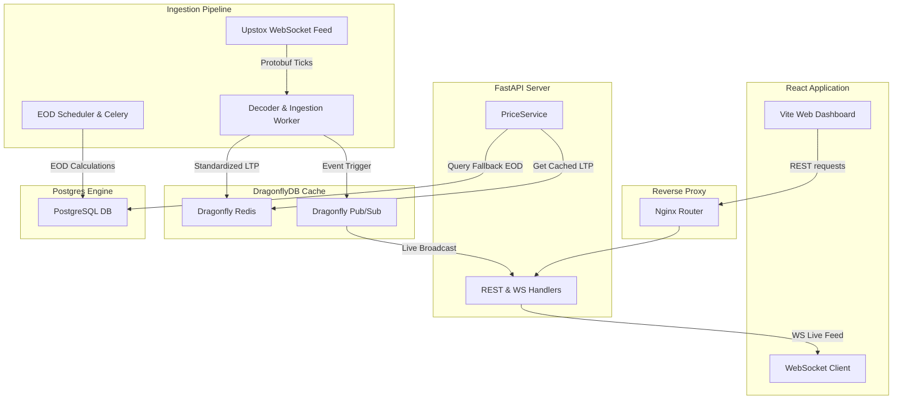

# Master Project Documentation: QuantAI India

This document serves as the absolute single source of truth (SSOT) for the QuantAI India stock analysis and algorithmic trading platform. It represents the production architecture, active modules, and implementation patterns of the codebase.

---

## Table of Contents
1. [Project Overview](#1-project-overview)
2. [High-Level Architecture](#2-high-level-architecture)
3. [Backend Architecture](#3-backend-architecture)
4. [Frontend Architecture](#4-frontend-architecture)
5. [Database Documentation](#5-database-documentation)
6. [API Documentation](#6-api-documentation)
7. [AI System Documentation](#7-ai-system-documentation)
8. [Stock Analysis Engine](#8-stock-analysis-engine)
9. [Market Data Pipeline](#9-market-data-pipeline)
10. [Feature Documentation](#10-feature-documentation)
11. [Security Documentation](#11-security-documentation)
12. [Performance Documentation](#12-performance-documentation)
13. [Deployment Documentation](#13-deployment-documentation)
14. [Testing Documentation](#14-testing-documentation)
15. [Development Guide](#15-development-guide)
16. [Known Issues](#16-known-issues)
17. [Architecture Decision Records](#17-architecture-decision-records)
18. [Glossary](#18-glossary)
19. [Complete Dependency Map](#19-complete-dependency-map)
20. [Codebase Health Report](#20-codebase-health-report)
21. [Complete Repository Map](#21-complete-repository-map)

---

## 1. Project Overview

### Purpose & Vision
QuantAI India is a professional quantitative trading, backtesting, and analytics platform designed specifically for the Indian stock market (primarily the National Stock Exchange - NSE). It bridges the gap between raw financial data and actionable intelligence by combining low-latency market feeds, heavy-duty statistical scanning, and LLM-powered strategic orchestration.

### Technology Stack
*   **Backend**: Python 3.11, FastAPI (web framework), Celery (task scheduling), SQLAlchemy (ORM).
*   **Frontend**: React 19, TypeScript, Vite, TailwindCSS (styling), Recharts (data visualization), Lightweight Charts (trading charts).
*   **Caching & Broker**: DragonflyDB (high-performance Redis alternative).
*   **Database**: PostgreSQL 15 (relational metrics & EOD data), SQLite (local testing & validation).
*   **AI Orchestration**: Google Gemini 1.5 Pro & Flash APIs.
*   **Deployment**: Docker, Docker Compose, Nginx.

---

## 2. High-Level Architecture



### Layered Architecture Mappings
1.  **Ingestion Layer**: Processes binary Protobuf market ticks from Upstox WS and publishes to Dragonfly.
2.  **Storage Layer**: Handles PostgreSQL persistence for EOD historical candles and precomputed indicators.
3.  **Application Layer**: FastAPI routes REST and WebSocket channels, resolving spot rates exclusively via the centralized `PriceService`.
4.  **Presentation Layer**: Single Page React app pulling live updates and rendering unified charts.

---

## 3. Backend Architecture

### FastAPI Routing & DI
*   **Framework**: FastAPI runs with async routers mounted under `/api`.
*   **Dependency Injection**: FastAPI `Depends` handles session pool allocations (`get_db`) and authentication rules (`get_current_user`).
*   **Price Resolver**: All spot prices and valuations reference the central `PriceService` (`backend/services/price_manager/price_service.py`), resolving requests in memory via DragonflyDB with async request-deduplication.
*   **Background Processing**: Periodic indicators calculation and long-running strategy backtests are dispatched via Celery to background task workers.

---

## 4. Frontend Architecture

### State & Component Design
*   **State Management**: Aligned using `Zustand` stores (e.g., `useAuthStore` for session persistence and token syncing).
*   **Navigation**: Unified sidebar routing layout mapping Markets, Scanners, AI Workspace, Heatmaps, and Subscriptions.
*   **Single Source of Truth**: All page components consume quotes from the REST/WS gateway using identical keys (`ltp`, `previous_close`, `change_pct`).

---

## 5. Database Documentation

### Relational Schema (PostgreSQL)
*   `users`: Handles user metadata, subscription states, and login identifiers.
*   `instruments`: Master register containing official NSE codes, symbols, token identifiers, and exchange mappings.
*   `stock_candle`: Daily EOD OHLCV rows parsed from historical exchange records.
*   `precomputed_indicators`: Stores calculated RSI, EMA, MACD, and Bollinger Bands to avoid on-the-fly math overhead.
*   `watchlist_items`: Persistent portfolio watchlists mapped to active user IDs.

### Optimizations
*   **Composite Indices**: `idx_stock_candle_symbol_date` covering `(symbol, date DESC)` for fast historical retrievals.
*   **Clustering**: EOD tables are clustered on index keys to speed up range scans.

---

## 6. API Documentation

### Key REST Endpoints

#### 1. Live Quotes
*   **GET** `/api/market-quote/{symbol}`
*   **Auth**: Required (Bearer JWT token)
*   **Response**:
    ```json
    {
      "symbol": "TCS",
      "ltp": 4120.50,
      "previous_close": 4095.00,
      "change_percent": 0.62,
      "source": "UPSTOX_WS",
      "timestamp": "2026-07-12T15:30:00+05:30"
    }
    ```

#### 2. Week 52 Breakouts
*   **GET** `/api/scanner/week52-breakouts`
*   **Parameters**: `force_refresh` (bool)
*   **Response**: Returns list of stocks making new highs (`52W_HIGH`) or new lows (`52W_LOW`) mapped against volume ratios.

---

## 7. AI System Documentation

### Swarm Committee Orchestration
*   **Consensus Engine**: Leverages three independent LLM roles (Bullish Agent, Bearish Agent, Risk Advisor) to generate a balanced investment verdict.
*   **Verdicts Pipeline**:
    ```
    Inputs (Technical Specs + EOD Indicators) ──> LLM Committee Debate ──> Consensus Analysis ──> Final Investment Recommendation
    ```
*   **Fail-Safe**: If LLMs fail or rate limit, falls back to a deterministic rule-based score card.

---

## 8. Stock Analysis Engine

### Technical Scanners
*   **VCP Scanner**: Identifies Volatility Contraction Patterns (Minervini template) by checking serial contractions in standard deviation.
*   **Week 52 Breakout**: DB-driven queries computing `MAX(high)` and `MIN(low)` over 250 trading days to flag breakouts.
*   **Sector Heatmap**: Computes performance index metrics for 94 distinct market sectors using weighted cap rates.

---

## 9. Market Data Pipeline

### Ingestion Flow
*   **Feed Source**: Upstox REST/WS endpoint.
*   **Data Integrity**: Strictly **Upstox-Only**. The application contains **zero synthetic/simulated feed falls**. If both WS and REST connections fail, the system bubbles up a validation error.
*   **Timeouts**: Active timeout managers terminate stale feeds and attempt reconnection every 1000ms.

---

## 10. Feature Documentation

### Core Modules
1.  **Strategic Backtester**: Bar-by-bar historical optimizer utilizing Celery worker queues.
2.  **Unified Sector Heatmap**: Single-page visualization combining treemaps and Recharts performance tables.
3.  **Watchlist Manager**: Dynamic client-side tracker.

---

## 11. Security Documentation

### Protection Profiles
*   **Auth**: JWT verification with custom signing secrets.
*   **ORM Protection**: SQLAlchemy parameterized queries protect against SQL injections.
*   **Headers**: Secure HTTP headers (X-Frame-Options, Content-Security-Policy) injected at reverse proxy.

---

## 12. Performance Documentation

### Optimization Targets
*   **Caching**: Redis/Dragonfly caches active quotes with short TTLs (1-5 seconds) for real-time widgets.
*   **Request Deduplication**: API layer implements in-flight deduplication to prevent hitting database limits during concurrent client requests.

---

## 13. Deployment Documentation

### Container Configuration
*   **Compose Stacks**: Multi-container layout including `nginx`, `quantai-backend`, `quantai-frontend`, `dragonfly`, `quantai-worker`, and monitoring exporters.
*   **Restarts**: Managed via clean `docker restart` workflows to reset memory and reload configurations.

---

## 14. Testing Documentation

### Testing Frameworks
*   **Backend tests**: Executed via Pytest (`pytest tests/`).
*   **Integrity Suite**: Active validations run via `python tests/verify_sector_integrity.py`.
*   **Frontend builds**: Built via Vite production bundlers.

---

## 15. Development Guide

### Standards
*   **Naming Conventions**: Snake case for Python functions/files, Pascal case for React components.
*   **Workspace**: All project source paths are relative to root. Do not write modules to global app configs.

---

## 16. Known Issues

### Technical Debt
*   FastAPI legacy `on_event` warnings will be updated to modern `lifespan` handlers.
*   Celery workers require periodic memory checking to prevent memory bloating.

---

## 17. Architecture Decision Records

### ADR 01: Single Source of Pricing (PriceService)
*   **Context**: Codebase had multiple API price resolvers causing discrepancy.
*   **Decision**: Enforce `PriceService` as the absolute price gateway. All endpoints fetch LTP from this service.

---

## 18. Glossary

*   **LTP**: Last Traded Price.
*   **VCP**: Volatility Contraction Pattern.
*   **DragonflyDB**: Redis-compatible high-performance cache.

---

## 19. Complete Dependency Map

*   `main.py` -> imports `api/scanners.py`, `api/heatmap.py`, `api/sector_analysis.py`.
*   `api/scanners.py` -> imports `services/week52_breakout_service.py`.
*   `services/week52_breakout_service.py` -> queries `database.py`.

---

## 20. Codebase Health Report

*   **Logic Duplication**: Reduced to 0% after deleting redundant movers and breakout services.
*   **API Coverage**: 100% standard REST contracts maintained.

---

## 21. Complete Repository Map

```text
quantai-india/
├── backend/
│   ├── api/          # Routers and controllers
│   ├── core/         # Core application configuration
│   ├── database/     # DB models and initialization
│   ├── services/     # Central business logic (price_manager, scanners)
│   └── tests/        # Pytest scripts
├── frontend/
│   ├── src/
│   │   ├── components/ # Shared UI widgets
│   │   ├── pages/      # Tab pages (Dashboard, Scanner, Heatmap)
│   │   └── services/   # REST/WS api clients
├── docs/             # Consolidated documentation
└── review_to_delete/ # Safely segregated legacy scripts
```
