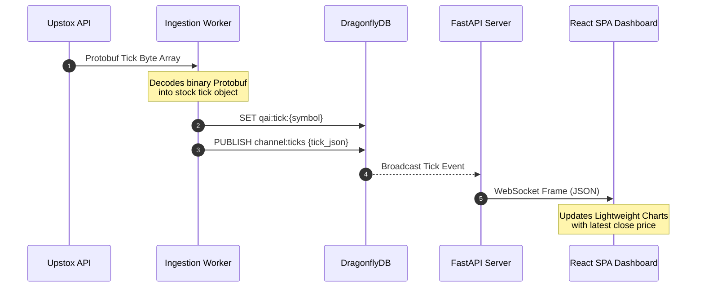
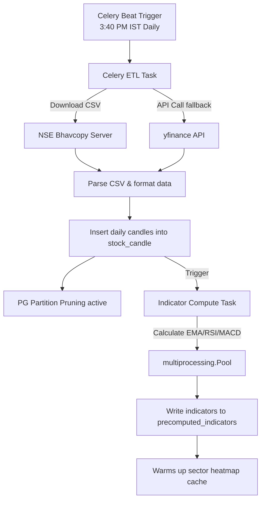

# Architecture Diagrams

This document contains Mermaid diagrams illustrating the high-level architecture, real-time data flows, and background processing systems of QuantAI India.

## 1. High-Level System Topology

```mermaid
graph TB
    subgraph Client ["Client Tier"]
        ReactDashboard["React Web App<br/>(Vite / TS)"]
    end

    subgraph API ["API & Gateway Tier"]
        NginxGateway["Nginx Reverse Proxy<br/>(Port 3000 -> 80)"]
        FastAPI["FastAPI Web Server<br/>(Uvicorn Workers)"]
    end

    subgraph Cache ["Caching & Broker Tier"]
        Dragonfly["DragonflyDB<br/>(Redis-compatible Cache & Broker)"]
    end

    subgraph Worker ["Worker & Background Tier"]
        CeleryWorker["Celery Worker Pool<br/>(Backtests, Bot, Indicators)"]
        IngestionWorker["Upstox Ingestor<br/>(WS Streaming Ticks)"]
    end

    subgraph Data ["Data & Storage Tier"]
        Postgres[("PostgreSQL DB<br/>(Primary & Replica)")]
        Parquet[("Parquet Warehouse<br/>(Columnar Tick Store)")]
    end

    subgraph External ["External Services"]
        UpstoxAPI["Upstox API<br/>(REST & WebSocket)"]
        Firebase["Firebase Auth SSO"]
    end

    ReactDashboard -->|1. HTTPS Request| NginxGateway
    NginxGateway -->|2. Reverse Proxy| FastAPI
    FastAPI -->|3. Read/Write State| Postgres
    FastAPI -->|4. Authenticate JWT| Firebase
    FastAPI -->|5. Read Cache / Enqueue Task| Dragonfly
    Dragonfly -->|6. Dequeue Task| CeleryWorker
    CeleryWorker -->|7. Query / Save Results| Postgres
    CeleryWorker -->|8. Load Columnar Data| Parquet

    UpstoxAPI -->|9. Stream ticks (Protobuf)| IngestionWorker
    IngestionWorker -->|10. Buffer & Publish ticks| Dragonfly
    FastAPI <-->|11. Real-time WS connection| ReactDashboard
```

---

## 2. Real-Time WebSocket Streaming Sequence



---

## 3. Background ETL Ingestion Flow


