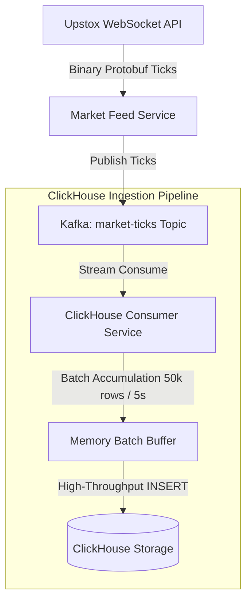

# ClickHouse Evaluation & Time-Series Analytical Database Blueprint

This document evaluates the migration of historical and real-time high-frequency tick data from PostgreSQL/SQLite to ClickHouse. It outlines the architectural design, schema definitions, ingestion pipelines, query performance, and integration steps once the tick scale surpasses the 100M+ milestone.

---

## 1. Context & Motivation

### Scalability Milestone
QuantAI currently tracks ~5,000 instruments. During active Indian stock market hours (09:15 to 15:30 IST, i.e., 6.25 hours), a full tick feed can generate:
$$\text{Ticks per Day} = 5,000 \text{ symbols} \times 1 \text{ tick/sec} \times 22,500 \text{ seconds} = 112.5 \text{ Million Ticks/Day}$$

At this volume:
- **1 Day**: ~112.5M ticks
- **1 Month**: ~2.4 Billion ticks
- **1 Year**: ~29 Billion ticks

### PostgreSQL Bottlenecks at Scale
1. **Write Amplification**: Inserting millions of ticks individually or in small batches leads to high write overhead on indices (`idx_candle_lookup`, composite primary keys). B-tree index rebalancing causes significant IO utilization.
2. **Disk Space Bloat**: Row-oriented databases store entire rows contiguously. With indexes, storing 100M ticks in PostgreSQL consumes **15GB–25GB**, whereas ClickHouse's columnar format can compress this to **< 1.5GB** (10x–15x savings).
3. **Query Latency Degeneracy**: Complex time-series analytical queries (e.g., computing a 50-day moving average or Bollinger Bands across hundreds of symbols) require scanning millions of records. PostgreSQL must fetch full rows from disk, saturating disk IO and CPU.
4. **Vacuum Contention**: Frequent updates and inserts result in dead tuples, keeping PostgreSQL autovacuum workers running constantly, causing locking and transaction processing degradation.

---

## 2. ClickHouse vs. PostgreSQL Comparison

| Architectural Attribute | PostgreSQL (Row-Oriented) | ClickHouse (Column-Oriented) |
| :--- | :--- | :--- |
| **Storage Layout** | Row-by-row (tuple-based) | Column-by-column (vectorized) |
| **Compression Ratio** | 1.2x – 2x (minimal compression) | 5x – 15x (LZ4 / ZSTD on columnar data) |
| **Ingestion Limit** | ~10k – 20k rows/second | ~500k – 1M+ rows/second (in batches) |
| **Aggregation Speed** | Slow (requires full row scans) | Extremely Fast (uses SIMD instructions) |
| **Index Types** | B-Tree, GIN, BRIN | Primary Key index, Sparse Index |
| **Hardware Overhead** | High RAM & SSD IOPS | High CPU (parallel processing), Low IO |

---

## 3. Clustered Target Schema Design

We design a partitioned, column-compressed ClickHouse schema mapped to the same logical domains as our `models_alpha.py` structure.

### A. Raw Market Ticks Table
This table stores raw ticks ingested directly from the Kafka event feed.

```sql
CREATE TABLE quantai.market_ticks (
    instrument_id UInt64,
    tick_ts DateTime64(6, 'Asia/Kolkata') CODEC(DoubleDelta, LZ4),
    last_price Decimal(12, 4) CODEC(T64, ZSTD),
    volume UInt64 CODEC(T64, LZ4),
    bid_price Decimal(12, 4) CODEC(T64, ZSTD),
    ask_price Decimal(12, 4) CODEC(T64, ZSTD),
    buy_sell_flag Enum8('NEUTRAL' = 0, 'BUY' = 1, 'SELL' = 2) CODEC(LZ4)
) ENGINE = MergeTree()
PARTITION BY toYYYYMM(tick_ts)
ORDER BY (instrument_id, tick_ts)
SETTINGS index_granularity = 8192;
```

### B. Consolidated Stock Candles Table
This table stores aggregated candles. Using `ReplacingMergeTree`, it deduplicates late-arriving updates using the `version` timestamp.

```sql
CREATE TABLE quantai.stock_candles (
    instrument_id UInt64,
    timeframe UInt16 CODEC(LZ4), -- Minutes: 1, 5, 15, 30, 60, 1440
    candle_ts DateTime64(0, 'Asia/Kolkata') CODEC(DoubleDelta, LZ4),
    open Decimal(12, 4) CODEC(T64, ZSTD),
    high Decimal(12, 4) CODEC(T64, ZSTD),
    low Decimal(12, 4) CODEC(T64, ZSTD),
    close Decimal(12, 4) CODEC(T64, ZSTD),
    volume UInt64 CODEC(T64, LZ4),
    version DateTime CODEC(LZ4)
) ENGINE = ReplacingMergeTree(version)
PARTITION BY toYYYYMM(candle_ts)
ORDER BY (instrument_id, timeframe, candle_ts)
SETTINGS index_granularity = 8192;
```

---

## 4. Real-time Ingestion Architecture



### Ingestion Guidelines
1. **Never Insert Single Ticks**: Single inserts degrade ClickHouse performance due to file system part fragmentation. Ingestion services must buffer ticks in memory.
2. **Optimal Batch Sizes**: Insert in batches of **10,000 to 100,000 rows** or every **5 seconds**.
3. **Kafka Engine vs. Custom Consumer**: While ClickHouse offers a native `Kafka` engine, a custom Python consumer provides better control over parsing Protobuf payloads, handling schema migrations, routing anomalies to quarantine, and logging metrics.

---

## 5. FastAPI Backend Integration

To integrate ClickHouse with our FastAPI endpoints, we utilize the high-performance HTTP client `clickhouse-connect`.

### Client Utility (`backend/services/clickhouse_client.py`)

```python
import clickhouse_connect
import logging
from config import settings

logger = logging.getLogger(__name__)

class ClickHouseClient:
    _instance = None

    def __new__(cls):
        if cls._instance is None:
            cls._instance = super(ClickHouseClient, cls).__new__(cls)
            cls._instance.client = None
        return cls._instance

    def connect(self):
        """Establish connection to ClickHouse server."""
        if self.client is None:
            try:
                self.client = clickhouse_connect.get_client(
                    host=settings.CLICKHOUSE_HOST,
                    port=settings.CLICKHOUSE_PORT,
                    username=settings.CLICKHOUSE_USER,
                    password=settings.CLICKHOUSE_PASSWORD,
                    database=settings.CLICKHOUSE_DB
                )
                logger.info("Successfully connected to ClickHouse DB.")
            except Exception as e:
                logger.error(f"Failed to connect to ClickHouse: {e}")
                raise
        return self.client

    def query_as_dataframe(self, query: str, parameters: dict = None):
        """Query ClickHouse and return a Pandas DataFrame for vectorized indicators."""
        client = self.connect()
        try:
            return client.query_df(query, parameters)
        except Exception as e:
            logger.error(f"ClickHouse query failed: {e}")
            raise
```

### Analytical Query Example: Rolling SMA
Calculating a rolling Simple Moving Average (SMA) directly in the database:

```sql
SELECT 
    candle_ts,
    close,
    avg(close) OVER (
        PARTITION BY instrument_id 
        ORDER BY candle_ts 
        ROWS BETWEEN 19 PRECEDING AND CURRENT ROW
    ) AS sma_20
FROM quantai.stock_candles
WHERE instrument_id = {inst_id:UInt64} 
  AND timeframe = {tf:UInt16}
  AND candle_ts >= {start_date:DateTime}
ORDER BY candle_ts ASC;
```

---

## 6. Zero-Downtime Migration & Deployment Strategy

To migrate the existing ~100M records without interrupting trading desks:

```
[Phase 1: Dual Write]
  Postgres (Primary)   --> Writes continue normally.
  ClickHouse (Shadow)  --> Ingestion worker replicates raw ticks to ClickHouse.
  
[Phase 2: Historical Sync]
  Dump historic candles from Postgres -> Parquet -> ClickHouse bulk import.
  
[Phase 3: Validation]
  Verify tick counts, OHLCV match, and signal parity.
  
[Phase 4: Traffic Cutover]
  Point FastAPI analytical / backtest routes to ClickHouse.
  Postgres retained for User, Auth, Orders, and Portfolio tables.
```

1. **Dual-Writing**: Maintain PostgreSQL as the system of record for active candles while routing historical data ingestion pipelines to write to both DBs.
2. **Verification & Audit**: Run hourly consistency checks comparing aggregated ClickHouse candles against PostgreSQL EOD values.
3. **Data Lifecycle (TTL)**: Configure ClickHouse to hold raw ticks for **30 days** and candles indefinitely, while trimming PostgreSQL's `stock_candle` to only hold the last **7 days** of short-interval candles. This keeps the PostgreSQL footprint tiny (< 5GB) and responsive.
