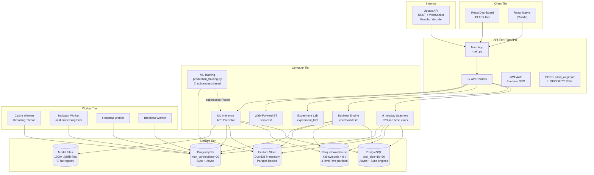
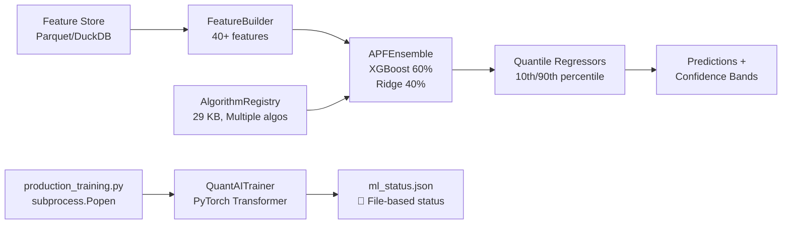

# QuantAI India — Exhaustive Codebase & Infrastructure Deep Analysis

> **Audit Date:** February 15, 2026  
> **Scope:** Full codebase (backend, frontend, ML, infrastructure, data storage)  
> **Methodology:** File-by-file, function-level code review of all critical paths

---

## Table of Contents
1. [Codebase Census](#1-codebase-census)
2. [Architecture Deep-Dive](#2-architecture-deep-dive)
3. [Backend Services Analysis (55 Services)](#3-backend-services-analysis)
4. [API Layer Analysis (17 Routers)](#4-api-layer-analysis)
5. [ML Pipeline End-to-End](#5-ml-pipeline-end-to-end)
6. [Backtesting & Experiment Lab](#6-backtesting--experiment-lab)
7. [Data Storage Layer](#7-data-storage-layer)
8. [Cache Infrastructure (DragonflyDB)](#8-cache-infrastructure-dragonflydb)
9. [Real-Time Data Pipeline](#9-real-time-data-pipeline)
10. [Worker Infrastructure](#10-worker-infrastructure)
11. [Database Layer](#11-database-layer)
12. [Docker & Infrastructure](#12-docker--infrastructure)
13. [Frontend Architecture](#13-frontend-architecture)
14. [Security Analysis](#14-security-analysis)
15. [Performance Bottleneck Heat Map](#15-performance-bottleneck-heat-map)
16. [Anti-Pattern Catalog](#16-anti-pattern-catalog)
17. [Technical Debt Register](#17-technical-debt-register)
18. [Detailed 90-Day Roadmap](#18-detailed-90-day-roadmap)

---

## 1. Codebase Census

| Metric | Value |
| :--- | :--- |
| **Total Python Files** | 456 |
| **Total Python LOC** | 61,330 |
| **Frontend TSX Files** | 49 |
| **Backend Services** | 55 |
| **API Routers** | 17 (16 domain + 1 v1 compat) |
| **ML Model Scripts** | 14 |
| **Strategy Implementations** | 25+ (Tier 1/2/3 + Lab) |
| **Worker Processes** | 4 (cache_warmer, indicator, heatmap, breakout) |
| **Docker Services** | 7 (backend, worker, dragonfly, frontend, prometheus, grafana, redis-exporter) |
| **Parquet Warehouse Symbols** | 439 |
| **Parquet Partition Depth** | 4 levels (symbol/timeframe/year/month) |
| **Database Tables** | stock_candle, instrument_master, nifty100_daily, precomputed_indicators, users, etc. |

### File Size Distribution (Top 10 Largest Backend Files)

| File | Size | LOC (est.) | Risk |
| :--- | :--- | :--- | :--- |
| `services/intraday_scanners.py` | 37 KB | 923 | 🔴 God class |
| `services/walk_forward_backtest_service.py` | 35 KB | ~850 | 🔴 Monolith |
| `core/backtest/advanced_strategies.py` | 60 KB | ~1400 | 🔴 Unmaintainable |
| `core/backtest/strategies_impl.py` | 45 KB | ~1000 | 🔴 Unmaintainable |
| `ml/algorithm_registry.py` | 30 KB | ~700 | 🟡 Complex but modular |
| `services/nifty100_ranking_service.py` | 30 KB | ~700 | 🟡 Complex |
| `services/market_data_orchestrator.py` | 24 KB | ~560 | 🟡 Core orchestrator |
| `services/backtest_engine.py` | 22 KB | ~500 | 🟡 Duplicate of core/ |
| `services/upstox_client.py` | 22 KB | ~500 | 🟡 API integration |
| `utils/upstox_proto.py` | 20 KB | ~460 | 🟢 Stable Protobuf |

---

## 2. Architecture Deep-Dive

### System Topology



### Startup Sequence (5 Background Tasks)

On `@app.on_event("startup")`:
1. `MarketDataOrchestrator.start()` — asyncio.create_task
2. `start_nifty100_ranking_service()` — asyncio.create_task  
3. `start_sector_service()` — asyncio.create_task
4. `start_realtime_breakout_service()` — asyncio.create_task
5. `RealtimeScannerEngine.initialize()` — awaited

> ⚠️ **Risk**: All 5 fire-and-forget with `create_task()`. No supervision, no restart on failure, no health monitoring. A single exception kills the task silently.

---

## 3. Backend Services Analysis

### Service Catalog (55 Services by Category)

#### Data Ingestion (6 services)
| Service | Lines | Purpose | Issues |
|:---|:---|:---|:---|
| `db_data_fetcher.py` | 418 | PG historical data | 🔴 No connection pooling (creates/closes per call), hardcoded 200-symbol cap, `LIMIT 10000` without pagination |
| `rest_data_fetcher.py` | ~280 | Upstox REST API | 🟡 Rate limit risks |
| `upstox_client.py` | ~500 | Upstox API wrapper | 🟢 Well-structured |
| `intraday_loader.py` | ~350 | Intraday candle loading | 🟡 Sync pg connection |
| `nifty500_fetcher.py` | ~170 | Universe definition | 🟢 Simple |
| `instrument_resolver.py` | ~230 | Symbol→Key mapping | 🟢 Cached |

#### Scanners (9 services)
| Service | Lines | Purpose | Issues |
|:---|:---|:---|:---|
| `intraday_scanners.py` | 923 | Base + 9 strategy scanners | 🔴 God class, sequential API calls per symbol |
| `hp_scanner_service.py` | ~220 | High-performance scanner | 🟡 Cache-first, DB fallback |
| `momentum_scanner.py` | ~190 | Momentum scoring | 🟢 Vectorized |
| `breakout_detector.py` | ~240 | Breakout detection | 🟢 Good |
| `mean_reversion_scanner.py` | ~220 | Mean reversion | 🟢 Good |
| `vwap_scanner.py` | ~130 | VWAP scanner | 🟢 Simple |
| `sr_bounce_scanner.py` | ~150 | Support/Resistance | 🟢 Good |
| `relative_strength_scanner.py` | ~160 | RS ranking | 🟢 Good |
| `gap_scanner.py` | ~120 | Gap detection | 🟢 Simple |

#### Analytics & Computation (8 services)
| Service | Lines | Purpose | Issues |
|:---|:---|:---|:---|
| `analytics_engine.py` | ~400 | Portfolio analytics | 🟡 Heavy computation inline |
| `indicator_compute_service.py` | ~430 | Indicator calculations | 🟡 Large, but modular |
| `risk_calculator.py` | ~350 | VaR, CVaR, Greeks | 🟢 Well-vectorized |
| `position_sizer.py` | ~210 | Position sizing | 🟢 Clean |
| `trend_analyzer.py` | ~100 | Trend analysis | 🟢 Simple |
| `top5_buysell.py` | ~400 | Buy/Sell signals | 🟡 Complex |
| `top_movers_service.py` | ~300 | Top movers | 🟡 Cache-dependent |
| `nifty100_ranking_service.py` | ~700 | Nifty100 ranking | 🔴 Long-running async loop |

#### Market Data (5 services)
| Service | Lines | Purpose | Issues |
|:---|:---|:---|:---|
| `market_data_orchestrator.py` | ~560 | Central data hub | 🔴 Complex, multiple fallback chains |
| `live_price_enricher.py` | ~280 | LTP enrichment | 🟡 Per-symbol API calls |
| `upstox_price_resolver.py` | ~260 | Price resolution | 🟡 Multiple fallback layers |
| `market_hours_service.py` | ~220 | IST market calendar | 🟢 Utility |
| `global_market_service.py` | ~280 | Global markets | 🟢 API-backed |

#### Cache & Storage (6 services)
| Service | Lines | Purpose | Issues |
|:---|:---|:---|:---|
| `dragonfly_client.py` | 333 | Redis/Dragonfly client | 🟡 Dual sync/async, DEV_MODE fallback |
| `cache.py` | ~210 | Legacy cache layer | 🟡 Redundant with dragonfly_client |
| `feature_store.py` | 138 | DuckDB-backed store | 🔴 SQL injection via string format, small file problem |
| `parquet_archive.py` | ~280 | Archive to Parquet | 🟢 Good |
| `metadata_cache_service.py` | ~390 | Metadata caching | 🟡 Complex |
| `memcached_client.py` | 13 | Deprecated stub | 🟢 Dead code, safe to delete |

#### Backtesting (3 services)
| Service | Lines | Purpose | Issues |
|:---|:---|:---|:---|
| `backtest_engine.py` | ~500 | Legacy backtest service | 🔴 Duplicate of core/backtest/ |
| `walk_forward_backtest_service.py` | ~850 | Walk-forward optimization | 🔴 Monolith, runs in-process |
| `earnings_scanner.py` | ~185 | Earnings-based scanner | 🟢 Good |

---

## 4. API Layer Analysis

### Router Summary (17 routers, 16 domain prefixes)

| Router | Prefix | Endpoints | Auth | Issues |
|:---|:---|:---|:---|:---|
| `health.py` | `/health` | 2 | ❌ | 🟢 Standard |
| `auth.py` | `/auth` | 3 | ❌/✅ | 🟢 Firebase + JWT |
| `market_data.py` | `/market` | 5 | ✅ | 🟢 Clean |
| `indicators.py` | `/indicators` | 2 | ✅ | 🟢 Simple |
| `scanners.py` | `/scanner` | 8+ WS | ✅ | 🟡 WebSocket complexity |
| `forecast.py` | `/forecast` | 3 | ✅ | 🔴 On-demand training path |
| `trading.py` | `/trading` | 4 | ✅ | 🟢 Order routing |
| `orders.py` | `/orders` | 3 | ✅ | 🟢 Simple |
| `analytics.py` | `/analytics` | 10+ | ✅ | 🟡 Heavy computation inline |
| `risk.py` | `/risk` | 2 | ✅ | 🟢 Delegated |
| `etl_status.py` | `/etl` | 1 | ✅ | 🟢 Status-only |
| `metrics.py` | `/metrics` | 10+ | ✅ | 🟡 Complex aggregations |
| `ai.py` | `/ai` | 3 | ✅ | 🟡 Gemini integration |
| `upstox.py` | `/upstox` | 6 | ✅ | 🟡 Auth flow |
| `admin.py` | `/admin` | 3 | ✅ | 🟢 Admin ops |
| `engines.py` | `/engines` | 1 | ✅ | 🟢 Stub |
| `ml_training.py` | `/train` | 3 | ✅ | 🔴 subprocess.Popen, global PID |

### Critical API Issues

1. **CORS `allow_origins=["*"]`**: All origins allowed. Must be restricted in production.
2. **`ml_training.py`**: Uses `subprocess.Popen` to launch training, tracks PID in global `_active_pid`. Breaks with multiple Uvicorn workers.
3. **`forecast.py`**: The `/predict` endpoint triggers training if no model exists (`model.train()` inside inference path). Can cause 60s+ timeouts.
4. **No rate limiting**: The `utils/rate_limit.py` exists (57 lines) but is not applied to any router.

---

## 5. ML Pipeline End-to-End

### Architecture



### Component Analysis

| Component | File | Lines | Issues |
|:---|:---|:---|:---|
| **Ensemble** | `ml/ensemble.py` | 208 | 🟡 joblib serialization, no versioning |
| **Predictor** | `ml/predictor.py` | 255 | 🔴 On-demand training, iterative auto-regression loop |
| **Feature Builder** | `ml/feature_builder.py` | ~160 | 🟢 40+ technical features |
| **Algorithm Registry** | `ml/algorithm_registry.py` | ~700 | 🟡 Complex but extensible |
| **Production Training** | `ml/production_training.py` | 173 | 🔴 Subprocess, no locks, JSON status file |
| **Ensemble Training** | `ml/ensemble_training.py` | ~270 | 🔴 API launches subprocess |
| **Transformer** | `ml/transformer_model.py` | ~100 | 🟡 PyTorch optional dependency |
| **Trainer** | `ml/trainer.py` | ~90 | 🟡 Multi-objective loss |
| **Dataset** | `ml/dataset.py` | ~75 | 🟢 Clean DataLoader |
| **Schemas** | `ml/schemas.py` | ~130 | 🟢 Pydantic models |
| **Model Files** | `ml/models/` | 1000+ files | 🔴 No registry, no cleanup, disk bloat |

### Critical ML Issues

1. **On-demand training in inference path** (`predictor.py:94-107`): If no pre-trained model exists, the request handler calls `model.train()` synchronously. This blocks the API worker for 30-60+ seconds.

2. **No model registry**: Models are stored as flat `.joblib` files in `ml/models/` directory. With 439 symbols × multiple timeframes, this generates thousands of files with no version tracking, no performance comparison, and no garbage collection.

3. **Subprocess training** (`ml_training.py`): Training is launched via `subprocess.Popen(["python", "production_training.py"])`. State is communicated via a JSON file (`ml_status.json`). This pattern:
   - Breaks with multiple Uvicorn workers (each has its own `_active_pid`)
   - Has no distributed lock (two users can start parallel trainings)
   - Provides no crash recovery

4. **Simplified auto-regression** (`predictor.py:222-242`): The iterative prediction loop only updates the first feature (returns). All other features (SMA, RSI, MACD, etc.) remain stale. This causes prediction quality to degrade rapidly after the first 2-3 horizon steps.

---

## 6. Backtesting & Experiment Lab

### Three Separate Backtest Engines (Code Duplication!)

| Engine | Location | Lines | Used By |
|:---|:---|:---|:---|
| **Core Engine** | `core/backtest/engine.py` | 370 | API via strategies |
| **Experiment Lab** | `experiment_lab/engine/backtest_runner.py` | 417 | Experiment Lab page |
| **Walk-Forward** | `services/walk_forward_backtest_service.py` | ~850 | Walk-Forward page |
| **Legacy** | `services/backtest_engine.py` | ~500 | Old API compat |

> 🔴 **Critical**: Four separate implementations of the same core logic. Bug fixes need to be applied in 4 places. This is the highest-priority technical debt.

### Backtesting Performance

**Current: Bar-by-bar Python loop**

```python
# engine.py:202 — The primary bottleneck
for bar_index, bar in enumerate(self.data_handler):
    filled_orders = self.executor.process_bar(bar, bar_index)
    history = self.data_handler.get_history(lookback=200)  # 🔴 Copies 200 rows per bar
    signals = strategy.on_bar(bar=bar, history=history, ...)
```

**Issues:**
- `get_history(lookback=200)` creates a DataFrame copy for every single bar
- All indicator calculations happen per-bar inside `on_bar()`
- No vectorization whatsoever
- Estimated performance: ~500-2000 bars/second in Python

**Target with vectorization:** 100,000-500,000 bars/second (using NumPy/Polars)

### Strategy Implementations

| Tier | Count | File | LOC |
|:---|:---|:---|:---|
| Tier 1 (Core) | 5 | `strategies/tier1/` | ~1000 |
| Tier 2 (Advanced) | 5 | `strategies/tier2/` | ~1000 |
| Tier 3 (Experimental) | 10 | `strategies/tier3/` | ~2000 |
| Experiment Lab | 10+ | `experiment_lab/lab_strategies/` | ~3000 |
| Core Advanced | ~30 | `core/backtest/advanced_strategies.py` | ~1400 |

---

## 7. Data Storage Layer

### Parquet Warehouse Structure

```
data/parquet/
├── symbol=RELIANCE/
│   ├── timeframe=1/          # 1-minute candles
│   │   ├── year=2022/month=01/data_2022_01.parquet  (~13 KB)
│   │   ├── year=2022/month=02/data_2022_02.parquet  (~13 KB)
│   │   └── ... (48 files per symbol for 4 years)
│   ├── timeframe=5/
│   ├── timeframe=15/
│   ├── timeframe=30/
│   ├── timeframe=60/
│   ├── timeframe=1440/       # Daily
│   └── timeframe=10080/      # Weekly
├── symbol=INFY/
├── ... (439 symbols total)
```

**Estimated file count:** 439 symbols × 8 timeframes × ~48 months = **~168,000+ Parquet files**

### Small File Problem Analysis

| Timeframe | Avg File Size | Files per Symbol | Total Files | Issue |
|:---|:---|:---|:---|:---|
| 1m | ~50 KB | 48 | 21,072 | 🔴 Very small |
| 5m | ~14 KB | 48 | 21,072 | 🔴 Tiny |
| 15m | ~5 KB | 48 | 21,072 | 🔴 Tiny |
| 30m | ~3 KB | 48 | 21,072 | 🔴 Metadata > Data |
| 60m | ~2 KB | 48 | 21,072 | 🔴 Metadata > Data |
| 1440m | ~1 KB | 48 | 21,072 | 🔴 Metadata >> Data |
| 10080m | ~0.5 KB | 48 | 21,072 | 🔴 Absurd |

> For files under 5 KB, the Parquet footer metadata can be **larger** than the actual data. This causes:
> - Excessive file system metadata overhead
> - Slow directory listing (Windows NTFS degrades badly with 100K+ files in nested dirs)
> - DuckDB/Polars must open/read each file header individually

### LakeDAL Analysis (`core/lake_dal.py`, 126 lines)

| Feature | Status |
|:---|:---|
| Polars scan_parquet | ✅ Lazy evaluation |
| Hive partitioning | ✅ Supported |
| Date filtering (pushdown) | ✅ Via Polars predicates |
| Decimal→Float cast | ✅ Automatic |
| `list_symbols()` | 🔴 Broken — references `self.raw_path` which doesn't exist |
| DuckDB instance | 🟡 Created but rarely used (`:memory:`) |
| Write path | 🟡 Writes single `data.parquet` per bucket, ignores year/month partitioning |

### Feature Store Analysis (`services/feature_store.py`, 138 lines)

| Issue | Severity | Detail |
|:---|:---|:---|
| **SQL Injection** | 🔴 Critical | `query_features()` builds SQL via f-string with user-provided `symbols` list. No parameterization. |
| **Same Small File Problem** | 🔴 High | Partitions by `version/timeframe/symbol/year/month` — creates even more tiny files |
| **`get_latest_timestamp`** | 🟡 Medium | Uses `Path.rglob("*.parquet")` to check existence — O(n) scan of all files |
| **DuckDB view warmup** | 🟡 Medium | Creates view over `**/*.parquet` glob — slow with many files |

---

## 8. Cache Infrastructure (DragonflyDB)

### `dragonfly_client.py` (333 lines) — Deep Analysis

| Feature | Implementation | Assessment |
|:---|:---|:---|
| **Singleton pattern** | `CacheManager.__new__` + module-level `_cache_manager` | 🟢 Clean |
| **Sync client** | `redis.ConnectionPool(max_connections=20)` | 🟢 Pooled |
| **Async client** | `redis.asyncio.Redis` (no pool) | 🟡 Single connection per worker |
| **DEV_MODE fallback** | In-memory dict `_in_memory_cache` | 🟡 No TTL enforcement in fallback |
| **Serialization** | `json.dumps/loads` | 🟡 No compression, no msgpack |
| **Hit/miss tracking** | Counter-based `_hits`, `_misses` | 🟢 Good |
| **Error handling** | Swallows all Redis errors, returns None | 🟡 Silent failures |
| **TTL policies** | 5s indicators, 5s scanners, 60s candles, 3600s metadata | 🟢 Reasonable |
| **Pipelined batch** | `mset()` with pipeline | 🟢 Efficient |

### TTL Policy Risks

| Key | TTL | Risk |
|:---|:---|:---|
| `INDICATOR` | 5s | 🟡 Very aggressive — causes high cache miss rate |
| `SCANNER` | 5s | 🟡 Same — scanners will miss cache frequently |
| `TOP_MOVERS_LIVE` | 10s | 🟢 Acceptable for live data |
| `METADATA` | 3600s | 🟢 Good for static data |

---

## 9. Real-Time Data Pipeline

### Upstox WebSocket Manager (`upstox_ws_manager.py`, 245 lines)

| Feature | Implementation | Assessment |
|:---|:---|:---|
| **Protocol** | Protobuf binary frames | 🟢 Efficient |
| **Reconnection** | Exponential backoff (1s, 2s, 4s..., 16s) | 🟢 Good |
| **Instrument resolution** | JSON file + DB fallback | 🟡 Startup-blocking |
| **Callback pattern** | `List[Callable]` — sync callbacks only | 🔴 Sync callbacks block event loop |
| **Singleton** | Module-level `_upstox_ws_manager` | 🟢 Standard |
| **Subscription** | Dynamic `subscribe(symbols)` | 🟢 Clean |
| **Error handling** | Per-callback try/except | 🟢 Isolated failures |

### WebSocket Feed Manager (`websocket_feed_manager.py`, ~85 lines)

> 🔴 **Pull-based pattern**: The feed manager runs a loop that calls `cache.get()` every 1 second to check for new data and then pushes to connected WebSocket clients. This should be replaced with a Pub/Sub model.

---

## 10. Worker Infrastructure

### Worker Catalog

| Worker | Type | Pattern | Issues |
|:---|:---|:---|:---|
| **Cache Warmer** | `threading.Thread` | Runs at 09:10 IST, 1-minute scheduler loop | 🟡 Thread-based, not restartable |
| **Indicator Worker** | `multiprocessing.Pool` | Batch compute across CPUs | 🟢 Good GIL avoidance |
| **Heatmap Worker** | Background task | Periodic heatmap calculation | 🟡 No error recovery |
| **Breakout Worker** | Background task | Yearly breakout detection | 🟢 Simple |

### Indicator Worker Deep Analysis (`workers/indicator_worker.py`, 361 lines)

- Uses `multiprocessing.Pool` to distribute indicator calculations
- Each `ComputeTask` processes one symbol's candles
- Custom implementations of EMA, RSI (not using pandas-ta or TA-Lib)
- **Issue**: Custom implementations are slower than optimized C libraries (TA-Lib) by ~10x

---

## 11. Database Layer

### SQLAlchemy Configuration (`database.py`, 36 lines)

| Parameter | Async Engine | Sync Engine |
|:---|:---|:---|
| **Driver** | `asyncpg` | Default psycopg2 |
| **pool_size** | 10 | 10 |
| **max_overflow** | 20 | 20 |
| **pool_pre_ping** | ✅ | ✅ |
| **echo** | False | Unset (default False) |

> 🟡 **Total connections**: 10+20 (async) + 10+20 (sync) = **60 max connections** to PostgreSQL. On a free-tier DB, this may exhaust the connection limit.

### Connection Management Issues

1. **`db_data_fetcher.py`**: Creates a new `psycopg2.connect()` per call instead of using the SQLAlchemy sync pool. Each call opens and closes a TCP connection.
2. **`intraday_scanners.py`**: Uses `AsyncSessionLocal()` for DB access — correct pattern.
3. **`parquet_etl.py`**: Uses raw `psycopg2` with `DATABASE_URL` env var — bypasses all pooling.

---

## 12. Docker & Infrastructure

### Docker Compose Services (7 containers)

| Service | Image | Ports | Health Check | Issues |
|:---|:---|:---|:---|:---|
| **dragonfly** | `dragonflydb/dragonfly` | 6379 | `redis-cli ping` ✅ | 🟢 Good |
| **backend** | Custom Dockerfile | 8000 | `curl /api/health/` ✅ | 🟡 `--reload` in prod! |
| **worker** | `Dockerfile.worker` | None | ❌ No health check | 🔴 Silent failures |
| **frontend** | Custom + nginx | 3000→80 | `wget` ✅ | 🟢 Good |
| **prometheus** | `prom/prometheus` | 9090 | ❌ | 🟡 No health check |
| **grafana** | `grafana/grafana` | 3001 | ❌ | 🟡 No health check |
| **redis-exporter** | `oliver006/redis_exporter` | 9121 | ❌ | 🟡 No health check |

### Docker Issues

1. **`--reload` flag in production**: `uvicorn main:app --reload` in `docker-compose.yml` causes file-watching overhead and restarts in production.
2. **No resource limits**: No `mem_limit`, `cpus`, or `deploy.resources` configured. A training job can consume all host memory.
3. **`host.docker.internal`**: Database URL uses `host.docker.internal:5432` — only works on Docker Desktop, not Linux or Kubernetes.
4. **Secrets in env**: `SECRET_KEY`, `JWT_SECRET`, `GRAFANA_PASSWORD` are in plain text in docker-compose.yml.
5. **No worker health check**: The `worker` container has no health check. If it crashes, Docker will restart it but there's no monitoring.
6. **Frontend port**: `127.0.0.1:3000:80` binds only to localhost. Fine for dev, but restricts access in production.

---

## 13. Frontend Architecture

### React + TypeScript (49 TSX files)

| Category | Files | Key Files |
|:---|:---|:---|
| **Pages** | 24 | Dashboard, Scanner, Backtest, ExperimentLab, PriceForecast, etc. |
| **Components** | 20 | Sidebar, SymbolSearch, VirtualizedTable, Charts (4), Scanner (2), etc. |
| **Charts** | 4 | EquityCurve, Drawdown, Distribution, MonteCarlo |
| **Contexts** | 1 | AuthContext |
| **Entry** | 1 | index.tsx, App.tsx |

### Frontend Performance Concerns

1. **No code splitting**: All 24 pages imported at root level. Initial bundle includes all pages.
2. **Charts**: Using Recharts — good for line charts but no WebGL for large datasets (10K+ points).
3. **VirtualizedTable**: Custom implementation — should verify it handles 500+ rows efficiently.
4. **No state management library**: Using React Context only. May cause unnecessary re-renders.

---

## 14. Security Analysis

| Issue | Severity | Location | Detail |
|:---|:---|:---|:---|
| **CORS `*`** | 🔴 Critical | `main.py:32` | `allow_origins=["*"]` allows any origin |
| **SQL Injection** | 🔴 Critical | `feature_store.py:93-99` | Symbol list interpolated into SQL string |
| **Secrets in docker-compose** | 🔴 High | `docker-compose.yml:42-44` | SECRET_KEY, JWT_SECRET in plain text |
| **No rate limiting** | 🟡 Medium | All routers | `utils/rate_limit.py` exists but unused |
| **joblib.load** | 🟡 Medium | `ml/ensemble.py:194` | Arbitrary code execution via pickle |
| **PRO access disabled** | 🟡 Medium | `forecast.py:64` | Commented out subscription check |
| **Default passwords** | 🟡 Medium | `docker-compose.yml` | `postgres:admin`, `grafana:admin` |

---

## 15. Performance Bottleneck Heat Map

| Component | Latency | Throughput | Scalability | Overall |
|:---|:---|:---|:---|:---|
| **Backtest Engine** | 🔴 | 🔴 | 🔴 | **🔴 Critical** |
| **ML Training** | 🔴 | 🔴 | 🔴 | **🔴 Critical** |
| **Parquet Storage** | 🔴 | 🟡 | 🔴 | **🔴 Critical** |
| **Forecast Inference** | 🔴 | 🟡 | 🟡 | **🟡 High** |
| **Intraday Scanners** | 🟡 | 🟡 | 🟡 | **🟡 High** |
| **WebSocket Feed** | 🟡 | 🟢 | 🟡 | **🟡 Medium** |
| **DragonflyDB Cache** | 🟢 | 🟢 | 🟢 | **🟢 Good** |
| **API Layer** | 🟢 | 🟢 | 🟡 | **🟢 Good** |
| **Database Queries** | 🟡 | 🟡 | 🟡 | **🟡 Medium** |

---

## 16. Anti-Pattern Catalog

| # | Anti-Pattern | Location | Impact | Fix |
|:---|:---|:---|:---|:---|
| 1 | **Subprocess Execution** | `ml_training.py` | Process orphaning, no distributed coordination | Replace with Celery/RQ task queue |
| 2 | **File-based IPC** | `ml_status.json` | Race conditions, no atomicity | Use DragonflyDB Pub/Sub |
| 3 | **On-demand Training** | `predictor.py:94` | 60s+ request timeouts, CPU spikes | Fail fast, queue background training |
| 4 | **God Class** | `intraday_scanners.py` | 923 lines, 9 strategies in one file | Split into per-strategy files |
| 5 | **Code Duplication** | 4 backtest engines | Bug fixes in 4 places | Unify into one core engine |
| 6 | **Global Singleton PID** | `_active_pid` | Breaks with multi-worker/container | Distributed lock in DragonflyDB |
| 7 | **Sync callbacks in async loop** | `upstox_ws_manager.py:225` | Blocks event loop on slow callbacks | Use `asyncio.create_task()` |
| 8 | **Connection-per-request** | `db_data_fetcher.py:79` | TCP overhead, connection exhaustion | Use SQLAlchemy connection pool |
| 9 | **String SQL Construction** | `feature_store.py:93` | SQL injection vulnerability | Use parameterized queries |
| 10 | **Dead code** | `memcached_client.py` (13 lines) | Confusion, maintenance burden | Delete |

---

## 17. Technical Debt Register

### Debt Score: 6.2/10 (1=pristine, 10=critical)

| Category | Items | Severity |
|:---|:---|:---|
| **Duplication** | 4 backtest engines, 2 cache clients | 🔴 High |
| **Security** | CORS *, SQL injection, secrets in compose, pickle loads | 🔴 High |
| **Architecture** | Subprocess ML training, file-based IPC, no task queue | 🔴 High |
| **Performance** | Bar-by-bar loops, no vectorization, 168K+ tiny files | 🔴 High |
| **Observability** | No distributed tracing, basic Prometheus setup, no alerts | 🟡 Medium |
| **Testing** | No automated test suite detected in any directory | 🔴 High |
| **Documentation** | `TECHNICAL_ARCHITECTURE.md` exists, good coverage | 🟢 Low |

---

## 18. Detailed 90-Day Roadmap

### Phase 1: Stabilization & Quick Wins (Days 1-30)

#### Week 1-2: Security & Stability
- [ ] **Fix CORS**: Restrict `allow_origins` to specific frontend domains
- [ ] **Fix SQL Injection**: Parameterize queries in `feature_store.py`
- [ ] **Remove `--reload`**: Use `--workers 4` in Docker production
- [ ] **Add Docker secrets**: Move secrets to Docker secrets or `.env` file
- [ ] **Delete dead code**: Remove `memcached_client.py`, legacy backtest
- [ ] **Fix `list_symbols()`**: Correct `self.raw_path` reference in `lake_dal.py`

#### Week 3-4: Performance Quick Wins
- [ ] **Coalesce Parquet files**: Merge monthly files into yearly for intraday TFs
- [ ] **Connection pooling**: Replace `psycopg2.connect()` in `db_data_fetcher.py` with `SessionLocal`
- [ ] **Add rate limiting**: Apply `rate_limit.py` middleware to all routers
- [ ] **Add worker health check**: Add health endpoint to Docker worker container
- [ ] **Baseline benchmarks**: Measure P95 latency for all API endpoints

### Phase 2: Architecture Improvements (Days 31-60)

#### Week 5-6: ML Pipeline
- [ ] **Disable on-demand training**: Return 503 if model missing, queue training
- [ ] **Implement distributed training lock**: Use DragonflyDB `SET NX` for training mutex
- [ ] **Replace JSON status**: Use DragonflyDB Pub/Sub for training progress
- [ ] **Model registry**: Track model versions, performance metrics, disk usage

#### Week 7-8: Backtest Unification
- [ ] **Unify engines**: Merge 4 backtest engines into one in `core/backtest/`
- [ ] **Vectorize indicators**: Pre-compute all indicators before simulation loop
- [ ] **Reduce history copies**: Use index-based slicing instead of DataFrame copies
- [ ] **Add timeout**: Engine-level timeout to prevent runaway backtests

### Phase 3: Scalability (Days 61-90)

#### Week 9-10: Storage Optimization
- [ ] **Parquet compaction**: Write a compaction job to merge small files
- [ ] **Feature Store v2**: Switch to parameterized DuckDB queries
- [ ] **S3 archive**: Move 2+ year old data to S3 with Athena access
- [ ] **Model cleanup**: Automated pruning of old joblib files

#### Week 11-12: Infrastructure
- [ ] **Celery/RQ**: Implement task queue for training and backtesting
- [ ] **Docker resource limits**: Add memory and CPU limits to all containers
- [ ] **Horizontal scaling**: Configure multi-worker Uvicorn without global state
- [ ] **Load testing**: Run Locust scenarios, establish SLAs
- [ ] **Alerting**: Configure Grafana alerts for P95 latency, error rate, queue depth

---

## Appendix A: File-Level Risk Assessment

### 🔴 Critical Risk Files (Must Fix)

| File | Risk | Reason |
|:---|:---|:---|
| `ml/predictor.py` | 🔴 | On-demand training in inference path |
| `api/ml_training.py` | 🔴 | subprocess.Popen + global PID |
| `services/feature_store.py` | 🔴 | SQL injection |
| `main.py` | 🔴 | CORS `*`, fire-and-forget tasks |
| `core/backtest/engine.py` | 🔴 | Bar-by-bar loop bottleneck |
| `services/intraday_scanners.py` | 🔴 | 923-line God class |
| `core/backtest/advanced_strategies.py` | 🔴 | 60 KB monolith |
| `docker-compose.yml` | 🔴 | Secrets, --reload, no resource limits |

### 🟡 Medium Risk Files (Should Fix)

| File | Risk | Reason |
|:---|:---|:---|
| `services/db_data_fetcher.py` | 🟡 | No connection pooling |
| `services/dragonfly_client.py` | 🟡 | DEV_MODE to prod leak |
| `ml/production_training.py` | 🟡 | JSON status file |
| `services/market_data_orchestrator.py` | 🟡 | Complex fallback chains |
| `database.py` | 🟡 | 60 max connections |

---

## Appendix B: Performance Maturity Scorecard

| Dimension | Score (/10) | Notes |
|:---|:---|:---|
| **Code Quality** | 7 | Well-structured but with God classes and duplication |
| **Performance** | 4 | Major bottlenecks in BT and ML paths |
| **Scalability** | 3 | Single-server architecture, no task queue |
| **Security** | 4 | CORS *, SQL injection, secrets in compose |
| **Observability** | 5 | Prometheus+Grafana present but minimal config |
| **Testing** | 2 | No automated test suite detected |
| **Documentation** | 7 | Architecture doc exists, good inline comments |
| **DevOps** | 5 | Docker Compose, no CI/CD detected |
| **Data Architecture** | 5 | Parquet+PG good; small file problem |
| **ML Ops** | 3 | No experiment tracking, no model registry |

**Overall Performance Maturity: 45/100**
