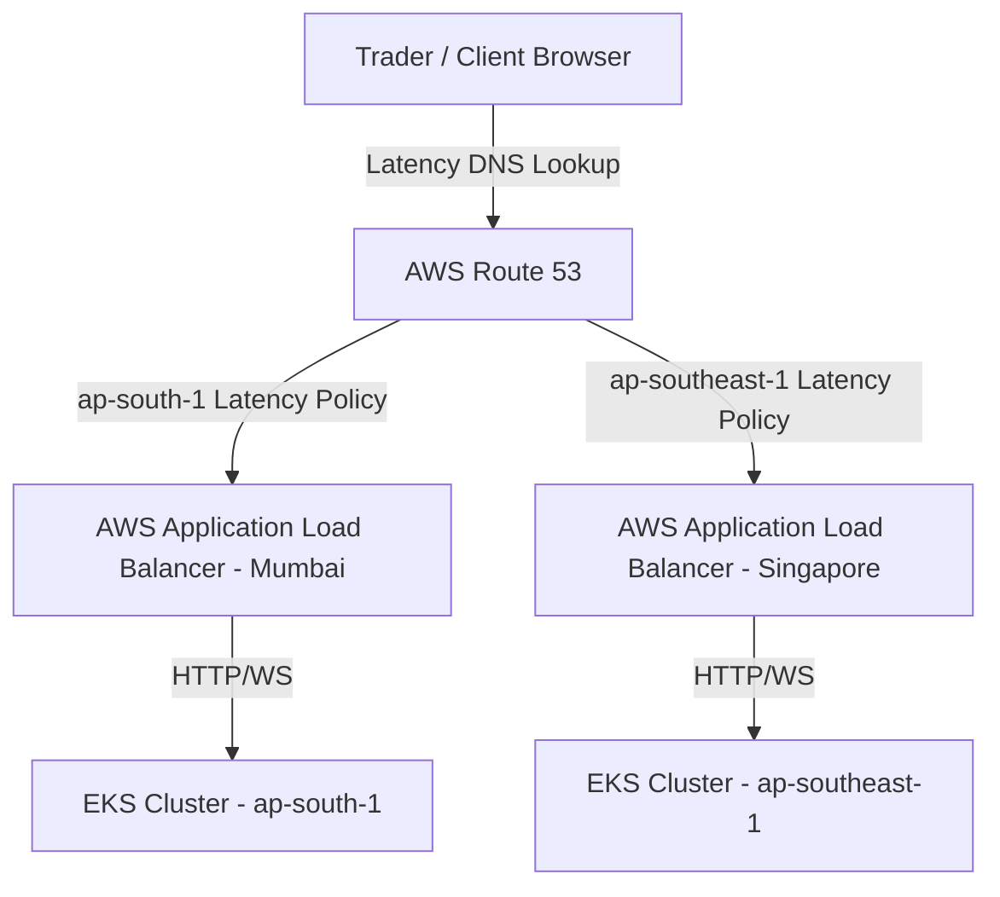

# Multi-Region Active-Active Enterprise Deployment Architecture

This document specifies the architecture, data replication strategies, load balancing policies, and disaster recovery runbooks to deploy QuantAI in a multi-region active-active topology across AWS Mumbai (`ap-south-1`) and Singapore (`ap-southeast-1`).

---

## 1. Global Traffic Management & DNS Routing



### Routing Policy
1. **AWS Route 53 Latency-Based Routing**: Traffic is dynamically routed to the region offering the lowest roundtrip network latency to the client.
2. **Health Checks & Failover**: Route 53 performs active health checks on the regional ALB `/health` endpoints. If a region becomes degraded, DNS records automatically failover to the secondary healthy region within **30 seconds** (RTO).

---

## 2. Distributed Data Tier Synchronization

To achieve active-active synchronization, data replication is configured across regional database clusters:

```
[ap-south-1 (Mumbai)]                        [ap-southeast-1 (Singapore)]
  Aurora Postgres (Primary)   ======Repl=====>  Aurora Postgres (Replica)
  DragonflyDB (Primary)       ======Repl=====>  DragonflyDB (Replica)
  Kafka (Broker ap-south)     <==MirrorMaker==> Kafka (Broker ap-southeast)
```

### A. Relational Data Layer (PostgreSQL)
- **Deployment**: AWS Aurora Global Database spanning `ap-south-1` and `ap-southeast-1`.
- **Replication**: Physical replication lag is typically **< 1 second** (RPO).
- **Read Operations**: Handled locally by read replicas in each region.
- **Write Operations**: Regional clusters forward writes directly to the primary cluster in Mumbai. In case of primary region outage, Singapore is promoted to primary database master via AWS RDS failover.

### B. Caching & State Layer (DragonflyDB)
- **Deployment**: Master-replica DragonflyDB nodes deployed regionally.
- **Replication**: Configured in active-passive global replication to replicate user session states, watchlist baseline prices, and pre-computed momentum snapshots across regions.

### C. Message Bus Layer (Apache Kafka)
- **Deployment**: Independent Kafka clusters in each region.
- **Mirroring**: Kafka MirrorMaker 2 (MM2) mirrors the `ticks.raw` and `ticks.processed` topics asynchronously.
- **Ingestion Failover**: If the primary Upstox WebSocket receiver in Mumbai drops connection, the Singapore ingestion client takes over, publishing to Singapore Kafka which mirrors back to Mumbai.

---

## 3. Disaster Recovery & Failover Metrics

| Dimension | Target Metric | Failover Mechanism |
| :--- | :--- | :--- |
| **RTO (Recovery Time)** | < 30 seconds | Automated Route 53 DNS failover routing. |
| **RPO (Recovery Point)** | < 1 second | Aurora Global replication pipeline. |
| **Ingestion Resiliency** | Active-Active | Regional Kafka MirrorMaker 2 syncing. |
| **User Session State** | State Persistent | Dragonfly Global replica synchronization. |

---

## 4. Runbook: Manual Regional Promotion

In the event of a catastrophic AWS region outage in `ap-south-1` (Mumbai):

1. **Promote Database Master**:
   Execute the AWS CLI command to detach and promote Singapore to a standalone primary database cluster:
   ```bash
   aws rds failover-global-cluster \
       --global-cluster-identifier quantai-global-db \
       --target-db-cluster-identifier quantai-singapore-cluster
   ```
2. **Disable Ingress in Primary Region**:
   Disable DNS records in Route 53 for the Mumbai load balancer:
   ```bash
   aws route53 change-resource-record-sets ...
   ```
3. **Redirect Ingest Consumers**:
   Configure the Singapore ingestion client to connect to the secondary broker stream directly.
