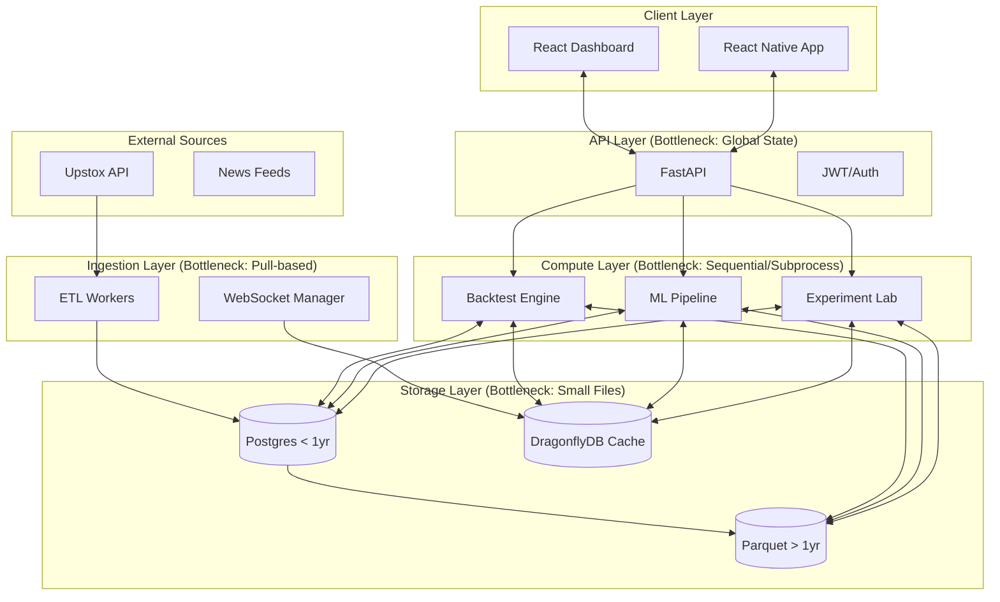

# Performance Improvement & Scalability Plan: QuantAI India

## 1. Executive Summary
QuantAI India is a sophisticated stock analysis platform with a robust modular monolith architecture. While the functional coverage is high, the system currently faces several architectural and performance bottlenecks that will limit scalability beyond a hundred concurrent users. The primary areas for improvement are the **backtesting engine's loop-based execution**, the **on-demand ML training model**, and the **fragmented Parquet storage strategy (Small File Problem)**. 

This roadmap outlines a 90-day transition from a single-server process-based model to a distributed, vectorized, and event-driven architecture capable of handling 10x - 100x current traffic.

---

## 2. System Architecture Diagram (Text-Based)

---

## 3. Top 10 Critical Bottlenecks (Ranked)

1.  **Backtest Engine Loop-based Execution**: Bar-by-bar iteration in Python for all strategies (main engine and Experiment Lab).
2.  **On-Demand ML Training**: Inference requests trigger training if no model exists, causing request timeouts and CPU spikes.
3.  **Parquet "Small File Problem"**: Over-partitioning (`symbol/timeframe/year/month`) results in ~200k+ tiny (KB-sized) files.
4.  **Process-based Training Management**: Training jobs are managed via local PIDs and global variables, breaking in multi-worker production environments.
5.  **Pull-based WebSocket Feed**: WebSocket manager loops and sleeps every 1s to pull data from DragonflyDB instead of being event-driven.
6.  **Slow Historical Data Access**: ML inference and scanners rely on SQL joins in Postgres instead of a high-performance Feature Store.
7.  **Sub-optimal Vectorization**: Financial indicators and signal generation are not fully vectorized across all modules.
8.  **Lack of Compute Isolation**: Training, Backtesting, and API Inference share the same container/resource pool.
9.  **Memory Bloat**: In-memory caching of models and dataframes in API workers leads to high memory footprint per process.
10. **Cache Miss Fallbacks**: Scanners falling back to DB scans on cache misses can cause cascading failures under load.

---

## 4. Quick Wins (Low Effort / High Impact)

- **Vectorize Metrics Calculation**: Move drawdown and CAGR calculations to NumPy/Polars in `backtest/engine.py`.
- **Implement Training Locks**: Replace local PID tracking with a Redis-based distributed lock to prevent multiple training sessions.
- **Adjust Parquet Partitioning**: Coalesce monthly files into yearly files for lower timeframes (1m, 5m).
- **Parallelize Scanners**: Use `asyncio.gather` for non-dependent scanner jobs in `api/scanners.py`.
- **Enable ZSTD Compression**: Switch all Parquet writes to ZSTD for better balance of speed vs compression ratio.

---

## 5. Medium-Term Improvements (1–3 months)

- **Distributed Task Queue**: Implement Celery or RQ for all background jobs (Training, Backtesting, ETL).
- **Event-Driven WebSockets**: Implement a Pub/Sub model for live price updates using DragonflyDB.
- **Compute Separation**: Move ML Training and Backtesting to dedicated worker containers with different resource limits.
- **Feature Store Integration**: Implement a hot-data layer in DragonflyDB containing the last 500 candles for all symbols to speed up inference.
- **Auto-regressive Lookback Optimization**: Replace iterative prediction loops in ML with vectorized batch inference.

---

## 6. Long-Term Architecture Improvements

- **Vectorized Backtest Engine**: Rewrite core loop to process entire dataframes at once where possible.
- **Cold Storage Archive**: Move 1yr+ Parquet data to S3 with Athena/DuckDB integration for large-scale research.
- **Model Registry**: Centralized service for model versioning, weight storage, and performance tracking.
- **Kubernetes Auto-scaling**: Horizontal Pod Autoscaling based on queue depth (for workers) and CPU (for API).

---

## 7. Backtesting Speed Optimization Plan

- **Target**: 50x speed improvement.
- **Strategy**: 
    1.  Convert the `DataHandler` to use a single Polars DataFrame instead of bar objects.
    2.  Use `df.shift()` for lookback signals instead of iterative lookup.
    3.  Implement "Pre-calculation" of all indicators before entering the simulation loop.
    4.  Parallelize multi-symbol backtests using `ProcessPoolExecutor`.

---

## 8. AI Training Optimization Plan

- **Target**: 99.9% inference reliability.
- **Strategy**:
    1.  **Stop on-demand training**: Fail inference if model is missing; queue training as a background task.
    2.  **Batch training**: Group training requests by sector or similar clusters.
    3.  **Warm Start**: Use transfer learning from a base model to reduce training time for new symbols.
    4.  **Experiment Tracking**: Integrate MLFlow or Weights & Biases for systematic experiment management.

---

## 9. Storage Optimization Plan (Parquet/S3)

- **Strategy**:
    1.  **Partition Merging**: Flatten `year/month` into a single file for Intraday (1m, 5m, 15m) data.
    2.  **Schema Enforcement**: Use PyArrow schemas to ensure consistent types (Float64 for all prices).
    3.  **S3 Object Prefixes**: Optimize symbol partitioning to avoid S3 request throttling.
    4.  **Metadata Caching**: Cache Parquet file footers to avoid repeated metadata reads.

---

## 10. Scalability Roadmap (1x → 10x → 100x Users)

- **1x-10x**: Optimize loops, add Redis distributed locking, horizontal scaling of API containers.
- **10x-50x**: Dedicated workers for BT/ML, Feature Store implementation, move to event-driven WebSockets.
- **50x-100x**: Multi-region deployment, S3-backed data lake with Athena, microservice split (ML, Trading, Data).

---

## 11. Estimated Performance Gains (%)

| Component | Target Gain | Metric |
| :--- | :--- | :--- |
| **Backtest Execution** | 1000% - 5000% | Time per 1yr backtest |
| **Inference Latency** | 300% | P99 latency (ms) |
| **Storage IO** | 500% | Cold data loading speed |
| **System Uptime** | 99% → 99.99% | Reliability under training load |

---

## 12. Cloud Cost Optimization Estimate (%)

- **Total Expected Savings: 30-40%**
- **Drivers**:
    - Reduced compute time via vectorization (20%).
    - More efficient data storage (DragonflyDB vs Redis, ZSTD Parquet) (10%).
    - Auto-scaling (stop idling workers) (10%).

---

## 13. Risk Assessment

- **Complexity Risk**: Moving to vectorized backtesting requires significant strategy rewrite.
- **Data Integrity**: Migration of Parquet partitions must be handled with strict checksum validation.
- **Cold Start**: Distributed workers may introduce latency for the first job; mitigated by pre-warming.

---

## 14. Performance Maturity Score: 62/100

---

## 15. Top 5 Technical Debt Risks

1.  **Global state in API workers**: `_active_pid` will eventually cause "ghost" training jobs.
2.  **Direct DB access in ML**: Inference speed is capped by Postgres query performance.
3.  **Lack of centralized logging**: Difficulty in tracing failures across subprocesses/workers.
4.  **No Automated Benchmarking**: Regressions in backtest speed are hard to detect currently.
5.  **Small File Problem**: File system index saturation and slow metadata aggregation.

---

## 16. Anti-Patterns Identified

- **Subprocess Execution**: Launching logic as independent `python` processes from an API.
- **Local File Audit**: Relying on local JSON/files for state synchronization.
- **Sync Fallbacks**: Falling back to synchronous, heavy computations during an HTTP request.
- **Memory-based Model Cache**: Storing heavy objects in API process memory without limits.

---

## 17. Observability Enhancement Plan

- **Metrics**: Export P95 latency and queue depths to Prometheus/Grafana.
- **Tracing**: Implement OpenTelemetry for cross-module request tracing (API → Worker → DB).
- **Audit Logging**: Move audit logs from text files to a dedicated table or ElasticSearch.

---

## 18. Benchmarking & Load Testing Strategy

- **Tooling**: Locust for load testing, Pyinstrument for CPU profiling.
- **Baseline**: Establish a "Standard Year Backtest" duration baseline for NIFTY 50.
- **CI/CD**: Reject PRs that increase backtest duration by more than 10%.

---

## 19. 90-Day Execution Plan with Milestones

### Phase 1: Stabilization (Days 1-30)
- [ ] Migrate Audit logs to Postgres.
- [ ] Implement Redis/DragonflyDB locks for training.
- [ ] Coalesce small Parquet files.
- [ ] Baseline existing performance.

### Phase 2: Vectorization & Feature Store (Days 31-60)
- [ ] Implement vectorized metrics and signal evaluation.
- [ ] Build the hot-cache Feature Store.
- [ ] Move to event-driven WebSocket updates.

### Phase 3: Infrastructure Scaling (Days 61-90)
- [ ] Deploy Celery/RQ workers.
- [ ] Split compute and API tiers.
- [ ] Final load testing and SLA verification.
