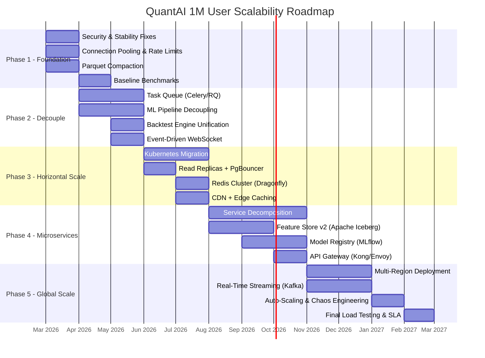
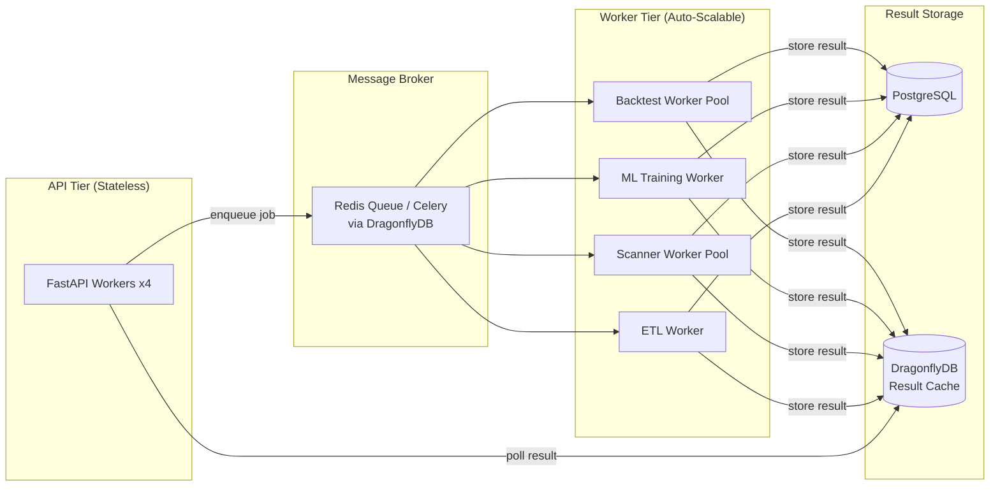
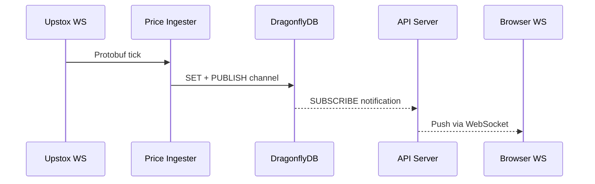
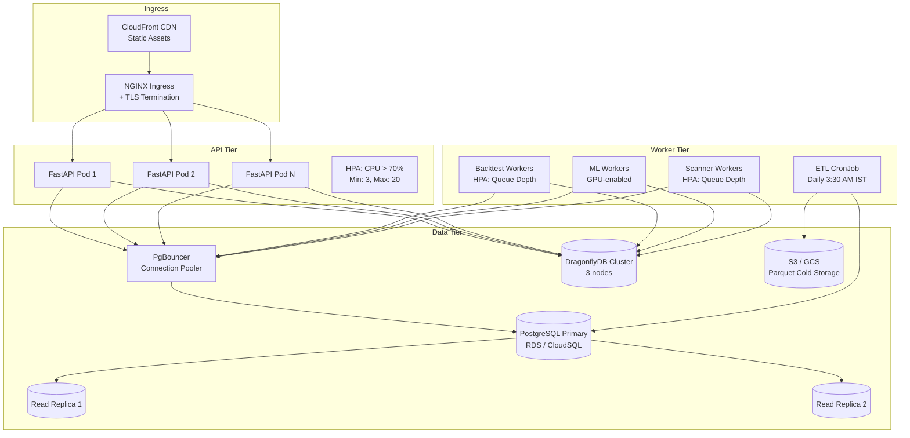
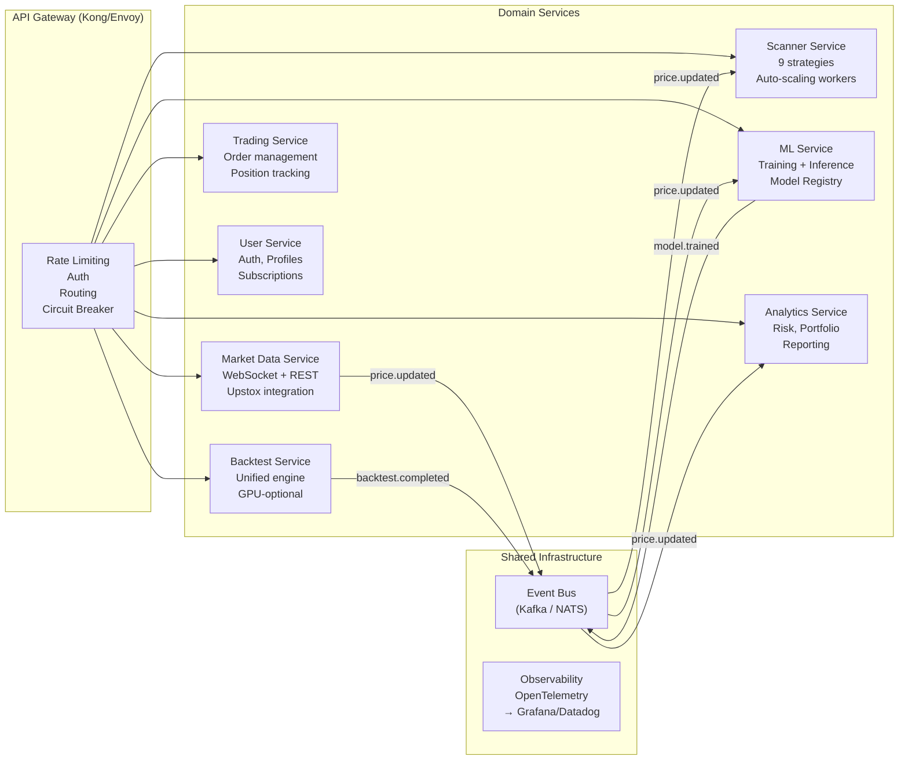
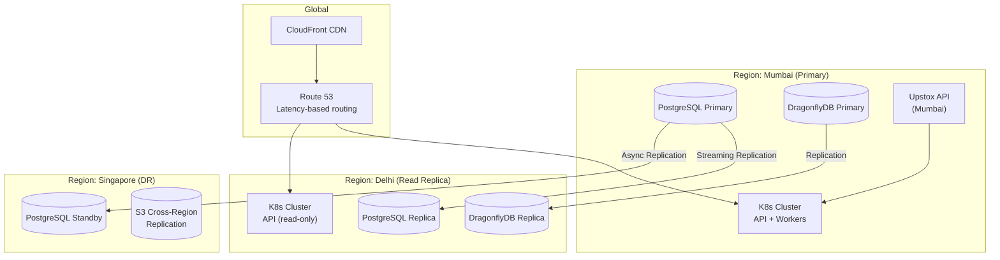
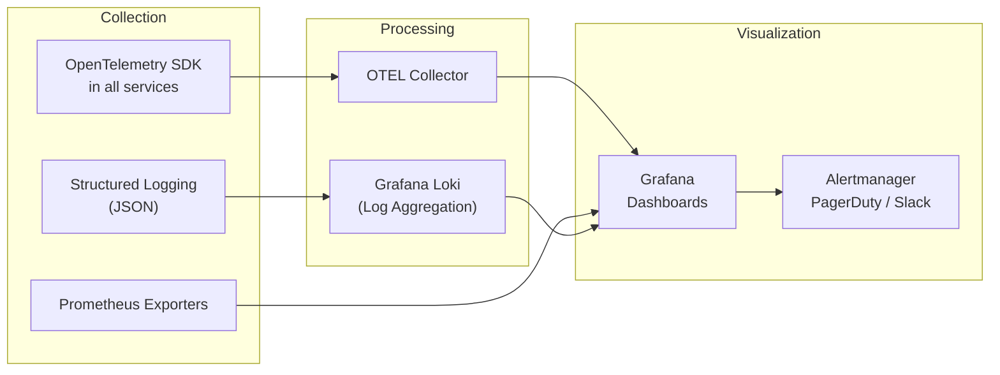
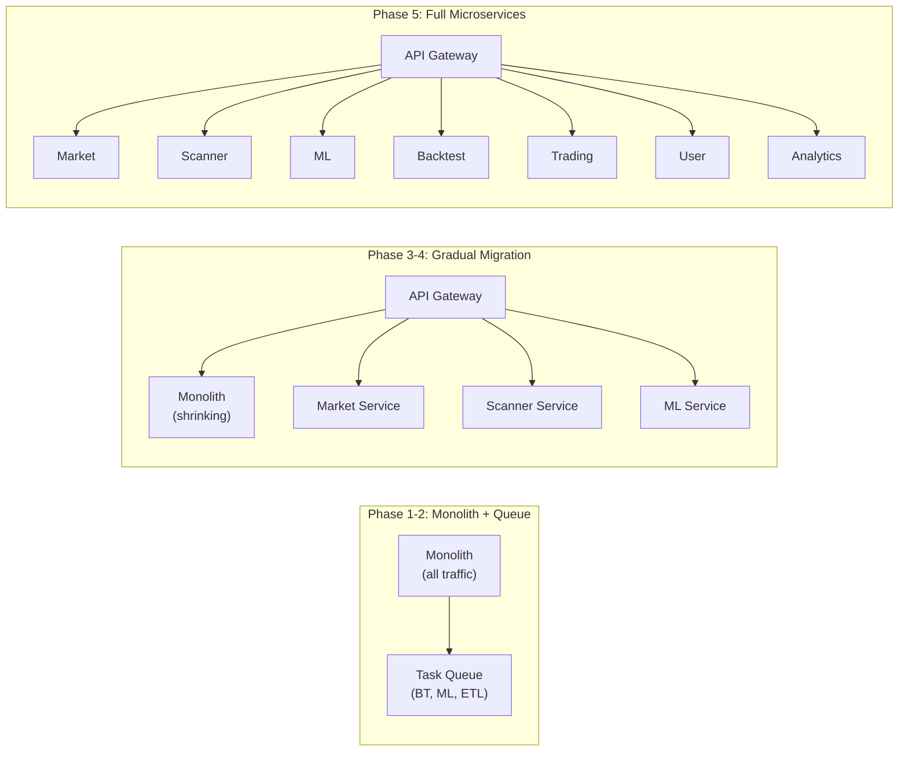

# QuantAI India — 1 Million User Scalability Architecture Plan

> **Based on:** [Deep Analysis Report](file:///c:/Users/Deepak%20Kumar/Downloads/quantai-india/docs/deep_analysis.md)  
> **Date:** February 15, 2026  
> **Target:** Scale from current single-server (10–100 users) to **1,000,000 concurrent users**

---

## Executive Summary

QuantAI India currently operates as a **modular monolith on a single Docker Compose stack**. The deep analysis revealed a maturity score of **45/100** with critical bottlenecks in backtesting (bar-by-bar loops), ML training (subprocess-based), and data storage (168K+ tiny Parquet files). Reaching 1M users requires a fundamental architectural transformation across **5 phases over 12 months**, evolving from a monolith to a cloud-native, event-driven microservices architecture.

### Current vs Target Capacity

| Metric | Current (Single Server) | Target (1M Users) | Factor |
|:---|:---|:---|:---|
| Concurrent API requests | ~50–100 | 100,000+ | **1000x** |
| Concurrent WebSocket connections | ~20 | 500,000+ | **25,000x** |
| Backtests per minute | 2–5 | 1,000+ | **200x** |
| ML inferences per second | 1–2 | 500+ | **250x** |
| Data ingestion (symbols) | 439 | 5,000+ | **12x** |
| P99 API latency | 2–5s | < 200ms | **10–25x faster** |
| Uptime SLA | ~95% (no formal SLA) | 99.99% | **Production-grade** |

---

## Phase Overview (12 Months)



---

## Phase 1: Foundation & Stability (Month 1–2)

**Goal:** Fix critical security issues, eliminate worst anti-patterns, establish baselines.

> [!CAUTION]
> These items are **blockers** for any scaling. Deploying to production without these fixes exposes the platform to security breaches and cascading failures.

### 1.1 Security Hardening

| Task | File | Change | Priority |
|:---|:---|:---|:---|
| Fix CORS | `main.py:32` | Replace `allow_origins=["*"]` with explicit domain list | 🔴 P0 |
| Fix SQL Injection | `feature_store.py:93` | Replace f-string SQL with parameterized DuckDB queries | 🔴 P0 |
| Rotate Secrets | `docker-compose.yml` | Move to Docker Secrets / Vault / AWS Secrets Manager | 🔴 P0 |
| Enable Rate Limiting | All routers | Apply the existing `rate_limit.py` as FastAPI middleware | 🔴 P0 |
| Disable DEV_MODE | `dragonfly_client.py` | Remove in-memory fallback in production builds | 🟡 P1 |
| Secure Model Files | `ml/ensemble.py:194` | Replace `joblib.load` with `safetensors` or signed artifacts | 🟡 P1 |

### 1.2 Connection & Resource Management

| Task | Current | Target |
|:---|:---|:---|
| **DB Connection Pooling** | `psycopg2.connect()` per call in `db_data_fetcher.py` | Use `SessionLocal` from SQLAlchemy pool |
| **Async Connection Pool** | Single `redis.asyncio.Redis` connection | `redis.asyncio.ConnectionPool(max_connections=50)` |
| **Docker Resource Limits** | No limits set | `mem_limit: 2g`, `cpus: '2.0'` for backend; `mem_limit: 8g` for workers |
| **Remove `--reload`** | `uvicorn --reload` in docker-compose | `uvicorn --workers 4 --loop uvloop` |
| **Worker Health Check** | None | Add `/health` endpoint + Docker `HEALTHCHECK` |

### 1.3 Data Storage Quick Wins

| Task | Impact |
|:---|:---|
| **Parquet compaction** — Merge monthly files into yearly for 1m/5m/15m timeframes | 168K files → ~15K files (90% reduction) |
| **Delete dead code** — Remove `memcached_client.py`, duplicated backtest engines | Reduce confusion |
| **Fix broken `list_symbols()`** in `lake_dal.py` | Unblock data discovery |

### 1.4 Baseline Benchmarks

Establish before/after metrics:
- P50 / P95 / P99 latency for all 17 API endpoint groups
- Backtest throughput (bars/second) for Standard Year Backtest
- ML inference latency (cold start vs warm)
- WebSocket throughput (messages/second)
- Database query performance (top 10 slowest queries)

**Tools:** Locust (load), Pyinstrument (CPU), `pg_stat_statements` (SQL)

---

## Phase 2: Decouple Compute from API (Month 2–4)

**Goal:** Separate long-running compute (backtesting, ML training) from the API request path. This is the **single most important phase** for scalability.

### 2.1 Task Queue Architecture



#### Files to Modify

| Component | Current | Target |
|:---|:---|:---|
| `api/ml_training.py` | `subprocess.Popen` + global `_active_pid` | Celery task `train_model.delay(symbol, tf)` |
| `ml/predictor.py` | On-demand `model.train()` in inference path | Return 503 + enqueue `train_model` task |
| `ml/production_training.py` | Standalone script, JSON status file | Celery task with DragonflyDB Pub/Sub progress |
| `core/backtest/engine.py` | Sync execution in API request | Celery task `run_backtest.delay(config)` |
| `experiment_lab/backtest_runner.py` | Same | Same pattern, shared backtest task |
| `services/walk_forward_backtest_service.py` | Same | Same pattern |

#### Distributed Training Lock

```python
# Replace global _active_pid with:
async def acquire_training_lock(symbol: str, timeout: int = 3600):
    cache = get_cache()
    lock_key = f"qai:lock:train:{symbol}"
    acquired = await cache.set_async(lock_key, "locked", ttl=timeout)
    return acquired  # Returns False if already locked
```

### 2.2 Backtest Engine Unification

**Current:** 4 separate implementations (2,137 total LOC of duplicated logic)

| Engine | Lines | Destination |
|:---|:---|:---|
| `core/backtest/engine.py` | 370 | ✅ Keep as single source |
| `experiment_lab/backtest_runner.py` | 417 | ❌ Delete, delegate to core |
| `services/walk_forward_backtest_service.py` | ~850 | ❌ Refactor to wrap core |
| `services/backtest_engine.py` | ~500 | ❌ Delete, was deprecated |

**Performance Target:** 500 bars/s → 100,000 bars/s (200x)

Key optimizations:
1. **Pre-compute all indicators** before entering the simulation loop (eliminate per-bar indicator recalculation)
2. **Replace `get_history(lookback=200)`** with index-based slicing (eliminate 200-row DataFrame copy per bar)
3. **Vectorize metrics** — move Sharpe, CAGR, max drawdown to NumPy
4. **Add configurable timeout** — prevent runaway backtests (default: 60s)

### 2.3 Event-Driven WebSocket

**Current:** Pull-based (poll DragonflyDB every 1s)  
**Target:** Push-based (DragonflyDB Pub/Sub)



This eliminates the 1-second polling delay and reduces DragonflyDB `GET` calls from ~500/s to 0.

---

## Phase 3: Horizontal Scaling (Month 4–6)

**Goal:** Move from Docker Compose to Kubernetes. Enable independent scaling of API, workers, cache, and database.

### 3.1 Kubernetes Architecture



### 3.2 Database Scaling Strategy

| Scale Level | Users | Strategy |
|:---|:---|:---|
| **1–10K** | 10,000 | PgBouncer (connection pooling: 200 pool connections → 20 PG connections) |
| **10K–100K** | 100,000 | + Read replicas for all `SELECT` queries (scanners, analytics, market data) |
| **100K–500K** | 500,000 | + Table partitioning for `stock_candle` by `timeframe` |
| **500K–1M** | 1,000,000 | + Citus/TimescaleDB for horizontal sharding by `instrument_id` |

#### PgBouncer Configuration

```ini
[pgbouncer]
pool_mode = transaction
max_client_conn = 1000
default_pool_size = 30
reserve_pool_size = 10
server_idle_timeout = 60
```

### 3.3 Cache Cluster Scaling

| Scale Level | DragonflyDB Config |
|:---|:---|
| **1–50K** | Single instance, max 4GB RAM |
| **50K–200K** | Primary + 1 replica (read separation) |
| **200K–1M** | 3-node cluster with consistent hashing, 12GB total |

### 3.4 CDN & Edge Strategy

| Asset | Cache Strategy | TTL |
|:---|:---|:---|
| React SPA bundle (JS/CSS) | CloudFront/CloudFlare | 1 year (versioned filenames) |
| Static chart libraries | CDN edge cache | 30 days |
| Scanner results (non-personalized) | Edge Function / Worker | 5–30s |
| User-specific data | No CDN (pass-through) | — |

**Expected reduction in backend load:** 40–60% of all requests served from CDN/edge.

---

## Phase 4: Microservice Decomposition (Month 6–9)

**Goal:** Split the monolith into independently deployable, scalable services.

### 4.1 Service Decomposition Map



### 4.2 Service Ownership Matrix

| Service | Source Files | Team | Scale Strategy |
|:---|:---|:---|:---|
| **Market Data** | `upstox_client`, `upstox_ws_manager`, `market_data_orchestrator`, `rest_data_fetcher`, `intraday_loader` | Data Engineering | 2–5 pods, WS-heavy |
| **Scanner** | `intraday_scanners` (refactored), `momentum_scanner`, `breakout_detector`, `gap_scanner`, etc. | Quant | 3–15 pods, CPU-burst |
| **Backtest** | `core/backtest/` (unified), strategies | Quant | 5–50 pods, CPU-heavy |
| **ML** | `ml/` directory | ML Engineering | 2–10 pods, GPU for training |
| **Trading** | `trading_service`, `order_service`, `position_sizer` | Platform | 3–5 pods, low latency |
| **User** | `auth_service`, `auth.py` | Platform | 2–5 pods, stateless |
| **Analytics** | `analytics_engine`, `risk_calculator`, `nifty100_ranking` | Data | 3–10 pods, compute-heavy |

### 4.3 Feature Store v2 (Apache Iceberg)

Replace the current DuckDB + tiny Parquet files with a proper lakehouse:

| Feature | Current | Target |
|:---|:---|:---|
| **Format** | 168K+ individual Parquet files | Apache Iceberg tables (auto-compacted) |
| **Query Engine** | DuckDB in-memory | Trino / StarRocks for analytics, DuckDB for edge queries |
| **Partitioning** | `symbol/tf/year/month` (over-partitioned) | `timeframe` partition + `symbol` sort key |
| **File Count** | ~168,000 | ~500–1,000 (optimized row groups) |
| **Cold Storage** | Local disk | S3 with lifecycle policies |
| **Schema Evolution** | None | Iceberg schema evolution |

### 4.4 Model Registry (MLflow)

| Feature | Current | Target |
|:---|:---|:---|
| **Storage** | 1000+ flat `.joblib` files | MLflow Model Registry + S3 artifact store |
| **Versioning** | None | Auto-versioned per training run |
| **Metrics** | None tracked | MSE, MAE, directional accuracy per version |
| **Deployment** | Load from disk on demand | Model serving with warm cache + A/B testing |
| **Cleanup** | None (disk bloat) | Auto-archive models older than 30 days |

### 4.5 API Gateway

| Feature | Implementation |
|:---|:---|
| **Rate Limiting** | Per-user token bucket (100 req/min free, 1000 req/min PRO) |
| **Authentication** | JWT validation at gateway (offload from services) |
| **Circuit Breaker** | Per-service circuit breaker (5xx threshold: 50%) |
| **Request Routing** | Path-based routing to microservices |
| **Load Balancing** | Round-robin with health checks |
| **Observability** | Automatic request tracing (OpenTelemetry) |

---

## Phase 5: Global Scale & Resilience (Month 9–12)

**Goal:** Multi-region deployment, real-time streaming, chaos engineering, and SLA enforcement.

### 5.1 Multi-Region Architecture



### 5.2 Real-Time Streaming Architecture (Kafka/NATS)

| Event | Producer | Consumers | Volume |
|:---|:---|:---|:---|
| `price.tick` | Market Data Service | Scanner, ML Inference, WebSocket Hub | 500K+ msg/min |
| `scanner.signal` | Scanner Service | WebSocket Hub, Notification Service | 10K msg/min |
| `backtest.result` | Backtest Service | Analytics, UI via WebSocket | 5K msg/min |
| `model.trained` | ML Service | Model Registry, Cache Warmer | 100 msg/day |
| `user.action` | All services | Audit Log, Analytics | 100K msg/min |

### 5.3 Auto-Scaling Rules

| Service | Metric | Scale Up | Scale Down | Min | Max |
|:---|:---|:---|:---|:---|:---|
| API | CPU > 70% | +2 pods | CPU < 30% for 5m | 3 | 20 |
| Scanner Workers | Queue depth > 50 | +3 pods | Queue empty for 5m | 2 | 30 |
| Backtest Workers | Queue depth > 10 | +5 pods | Queue empty for 10m | 1 | 50 |
| ML Inference | P99 latency > 500ms | +2 pods | P99 < 100ms for 5m | 2 | 10 |
| ML Training | GPU utilization < 50% | — | Spot instance reclaim | 0 | 5 |
| WebSocket Hub | Connection count > 10K | +1 pod | Connections < 5K | 2 | 20 |

### 5.4 Chaos Engineering & Resilience Testing

| Test | Frequency | Tool | Expected Behavior |
|:---|:---|:---|:---|
| Pod kill (random) | Weekly | Litmus Chaos | Auto-restart, no user impact |
| Network partition | Monthly | Toxicproxy | Graceful degradation, circuit breaker trips |
| Database failover | Quarterly | Manual + PG failover | < 30s downtime, automatic reconnection |
| Cache flush | Monthly | Manual | Cold start within 60s, no errors |
| Load spike (10x normal) | Monthly | Locust | Auto-scale within 2 minutes |

### 5.5 SLA Targets

| Metric | Target | Measurement |
|:---|:---|:---|
| **Availability** | 99.99% (52 min downtime/year) | Uptime Robot + Synthetic probes |
| **API P50 Latency** | < 50ms | Prometheus histogram |
| **API P99 Latency** | < 200ms | Prometheus histogram |
| **WebSocket Latency** | < 100ms from tick to client | End-to-end tracing |
| **Backtest Queue Time** | < 30s | Celery task metrics |
| **ML Inference** | < 500ms cold, < 100ms warm | Custom metrics |
| **Data Freshness** | < 2 minutes from market | Lag monitoring |

---

## Infrastructure Cost Model

### Estimated Monthly Cost at Scale

| Component | 10K Users | 100K Users | 1M Users |
|:---|:---|:---|:---|
| **Compute (K8s)** | $800/mo | $3,000/mo | $15,000/mo |
| **Database (RDS/CloudSQL)** | $200/mo | $1,000/mo | $5,000/mo |
| **Cache (DragonflyDB)** | $50/mo | $300/mo | $1,500/mo |
| **Storage (S3 + EBS)** | $50/mo | $200/mo | $1,000/mo |
| **CDN (CloudFront)** | $30/mo | $200/mo | $2,000/mo |
| **Monitoring (Datadog)** | $100/mo | $500/mo | $2,000/mo |
| **Streaming (Kafka)** | $0 | $500/mo | $3,000/mo |
| **ML GPU (Spot)** | $100/mo | $300/mo | $1,000/mo |
| **Total** | **~$1,330/mo** | **~$6,000/mo** | **~$30,500/mo** |

> [!TIP]
> With spot instances for workers and reserved instances for database, costs can be reduced by **30–40%** at the 1M tier.

---

## Observability Stack (End-to-End)



### Key Dashboards

| Dashboard | Metrics |
|:---|:---|
| **API Performance** | P50/P95/P99 latency, QPS, error rate by endpoint |
| **Worker Health** | Queue depth, processing rate, failure rate |
| **Database** | Active connections, query duration, replication lag |
| **Cache** | Hit rate, memory usage, eviction rate |
| **ML Pipeline** | Training duration, inference latency, model accuracy |
| **Business** | DAU, active backtests, predictions served, revenue |

### Alerting Rules

| Alert | Condition | Severity | Channel |
|:---|:---|:---|:---|
| API Error Rate > 5% | 5min window | 🔴 Critical | PagerDuty |
| P99 > 2s | 5min window | 🟡 Warning | Slack |
| DB Connections > 80% | Instant | 🔴 Critical | PagerDuty |
| Cache Hit Rate < 50% | 15min window | 🟡 Warning | Slack |
| Worker Queue > 100 | 5min window | 🟡 Warning | Slack |
| Replication Lag > 30s | Instant | 🔴 Critical | PagerDuty |
| Disk > 85% | Instant | 🔴 Critical | PagerDuty |

---

## Migration Strategy (Zero-Downtime)

### Strangler Fig Pattern



### Key Principles
1. **Feature flags** — Route a percentage of traffic to new services
2. **Shadow mode** — Run new services in parallel, compare results before switching
3. **Database-per-service** — Each service owns its data; use events for cross-service communication
4. **Backward compatibility** — Keep API contracts stable during migration

---

## Technology Stack Summary

| Layer | Current | Target (1M Users) |
|:---|:---|:---|
| **Orchestration** | Docker Compose | Kubernetes (EKS/GKE) |
| **API Framework** | FastAPI (monolith) | FastAPI (per-service) + API Gateway |
| **Task Queue** | subprocess.Popen | Celery + Redis/DragonflyDB |
| **Database** | PostgreSQL (single) | PostgreSQL (primary + 2 read replicas) + PgBouncer |
| **Cache** | DragonflyDB (single) | DragonflyDB Cluster (3 nodes) |
| **Data Lake** | Parquet on local disk | Apache Iceberg on S3 |
| **Streaming** | Pull-based polling | Apache Kafka / NATS |
| **CDN** | None | CloudFront / CloudFlare |
| **Observability** | Prometheus + Grafana (basic) | OpenTelemetry + Grafana + Loki + Alertmanager |
| **ML Ops** | Flat joblib files | MLflow Model Registry |
| **CI/CD** | None detected | GitHub Actions → ArgoCD (GitOps) |
| **Secrets** | Plain text in docker-compose | HashiCorp Vault / AWS Secrets Manager |
| **Auth** | JWT + Firebase (per-service) | Centralized at API Gateway |

---

## Risk Assessment

| Risk | Probability | Impact | Mitigation |
|:---|:---|:---|:---|
| **Migration data loss** | Low | 🔴 Critical | Checksum validation, parallel run, rollback plan |
| **Strategy rewrite for vectorized BT** | Medium | 🟡 High | Adapter pattern: wrap existing strategies |
| **Kubernetes learning curve** | High | 🟡 Medium | Managed K8s (EKS/GKE), Helm charts |
| **Cost overrun** | Medium | 🟡 Medium | Start with spot instances, set budget alerts |
| **Team scaling** | High | 🟡 High | Microservice ownership model, documentation |
| **Kafka operational complexity** | Medium | 🟡 Medium | Start with managed Kafka (MSK/Confluent Cloud) |
| **Cold start latency after scale** | Low | 🟢 Low | Cache warming, pre-scaled minimum pods |

---

## Success Metrics

| Milestone | Metric | Target Date |
|:---|:---|:---|
| Phase 1 Complete | All P0 security issues fixed, benchmarks established | Month 2 |
| Phase 2 Complete | Zero subprocess calls, task queue operational | Month 4 |
| Phase 3 Complete | Running on Kubernetes, auto-scaling active | Month 6 |
| Phase 4 Complete | 4+ independent microservices deployed | Month 9 |
| Phase 5 Complete | 1M user load test passes at 99.99% uptime | Month 12 |
| **Final Maturity Score** | **85+/100** (up from current 45/100) | Month 12 |
