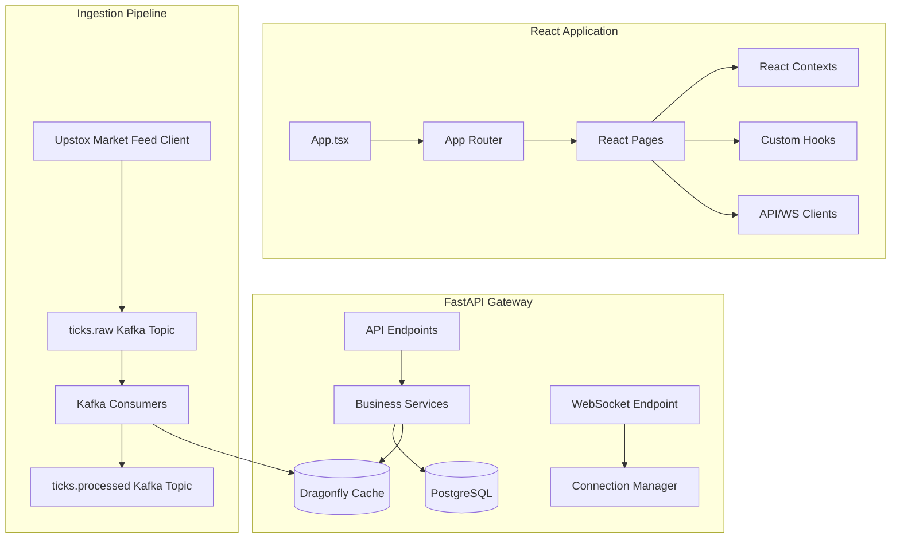

# Phase 1: SYSTEM_ARCHITECTURE.md

## 1. Subsystem Decomposition & Interaction
The QuantAI trading platform is organized into three decoupled logical layers: the React-based Frontend, the FastAPI-based REST API/WebSocket Gateway, and the Standalone Ingestion Microservice Pipeline.

### Subsystems:
1. **Frontend React Client**: Handles visualization of watchlist, heatmaps, scanners, and option chains. Employs `useGlobalSymbol` and `useQuantContext` for state distribution.
2. **Backend API Gateway (FastAPI)**: Serves analytics, historical candles, watchlist updates, and dashboard diagnostics.
3. **Standalone Market Feed Service**: Written in Python. Stream ticks via Upstox WebSocket feed, decodes Protobuf ticks, and publishes them asynchronously to Kafka.
4. **Dragonfly DB Cache**: Fast Redis-compatible memory cache storing current market prices (`price:{symbol}`) and sector/constituent listings.
5. **PostgreSQL Database**: Holds long-term candle data, instrument lists, and user configuration metadata.

---

## 2. Directory Structure & Key Files
- `frontend/src/`
  - `pages/`: OptionFlow.tsx, Watchlist.tsx, Scanner.tsx, Dashboard.tsx
  - `contexts/`: QuantContext.tsx, GlobalSymbolContext.tsx, AuthContext.tsx
  - `services/`: marketDataService.ts, api.ts
- `backend/`
  - `api/`: option_flow.py, volatility.py, volume_profile.py, system.py, metrics.py
  - `services/`: upstox_price_resolver.py, instrument_resolver.py, derivatives_service.py
  - `database.py`: PostgreSQL engine configuration.
  - `main.py`: ASGI server entry point.
- `docs/audit/`: Audit report artifacts.

---

## 3. Database Schema Mapping
- **`instrument_master`**: Holds 9,357 NSE instruments. Columns: `instrument_id` (PK), `instrument_key` (Indexed), `symbol`, `exchange`, `is_active`.
- **`stock_candle`**: Contains 2,091,305 daily and intraday historical candles. Columns: `candle_ts` (PK), `instrument_id` (PK, FK), `open`, `high`, `low`, `close`, `volume`, `timeframe`.
- **`intraday_candles`**: Large table holding 40,224,720 tick-level candles.
- **`stock_candle_archive`**: Archive table with 245,393,561 historical records.
- **`users`**: Stores 54 registered user profiles.
- **`watchlist`**: Stores 4 watchlists.
