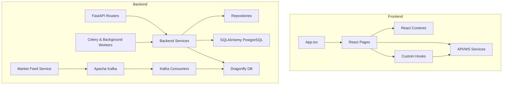

# QuantAI System Dependency Map

This document maps the architectural dependencies of the QuantAI trading platform across backend services, routers, background tasks, database models, and frontend components.

## 1. Backend Core & Service Dependency Graph
- **FastAPI Router Entry Point (`backend/main.py`)**: Imports and mounts all router modules from `backend/api/` (e.g. `option_flow`, `scanners`, `watchlist`, `volatility`, etc.).
- **Metadata Cache Service (`backend/services/metadata_cache_service.py`)**: Warmed up at system startup. Connects to `dragonfly_client.py` and is accessed by various routers for symbol/strategy metadata.
- **Upstox Price Resolver (`backend/services/upstox_price_resolver.py`)**: Used by watchlist, scanner, and option flow routers. Reads live ticks from Dragonfly (`price:{symbol}`) with EOD database fallback using SQLAlchemy models.
- **Stand-alone Market Feed Service (`backend/services/market_feed_service/`)**: Runs independently. Connects to Upstox WebSocket via `feed_client.py`, encodes to Protobuf, publishes to Kafka (`ticks.raw`).
- **Kafka Consumers (`backend/services/market_feed_service/consumers.py`)**: Subscribes to Kafka, processes ticks, writes to Dragonfly (`price:{symbol}`) and publishes back to processed topics.

## 2. Database & Repository Dependency Graph
- **Database Engine (`backend/database.py`)**: Exposes `SessionLocal` (sync) and `AsyncSessionLocal` (async) connections to PostgreSQL.
- **Models (`backend/models_alpha.py`, `models_saas.py`, `models_bot.py`)**: Defines `InstrumentMaster` (source of truth for equities), `StockCandle` (timeseries candles), `User`, `Watchlist`, `WatchlistSymbol`.
- **Repositories (`backend/repositories/`)**:
  - `user_repository.py`: Maps user CRUD operations.
  - `watchlist_repository.py`: Manages watchlists.
  - `scanner_repository.py`: Persists scan results.

## 3. Frontend Component & Hook Dependency Graph
- **Entry point (`frontend/src/index.tsx`)**: Mounts `App.tsx` wrapped in `AuthContext` and `QuantContext`.
- **Pages (`frontend/src/pages/`)**:
  - `Dashboard.tsx`: Main user landing view. Depends on `QuantContext`, `useApi`, and recharts components.
  - `OptionFlow.tsx`: Advanced options charting page. Query endpoints for heatmap, option charts, and PCR ratios.
  - `Scanner.tsx`: Configures and views real-time scanners.
- **Hooks (`frontend/src/hooks/`)**:
  - `useApi.ts`: Wrapper for all HTTP client calls.
  - `useMarketDataStream.ts`: Manages WebSocket connections for streaming tick data.
