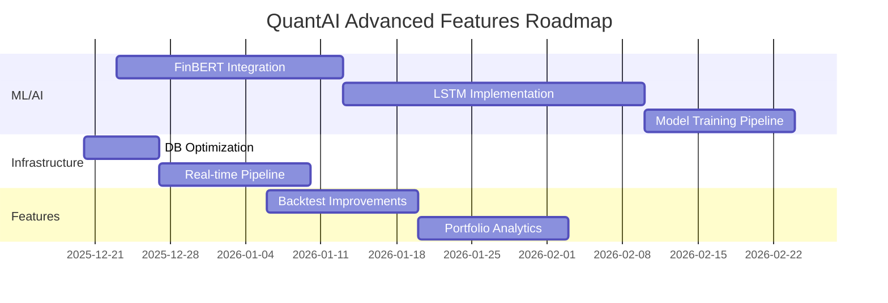

# QuantAI India - Technical Debt Document

> **Last Updated:** December 18, 2025  
> **Status:** Active Development  
> **Priority Legend:** 🔴 Critical | 🟠 High | 🟡 Medium | 🟢 Low

---

## Executive Summary

This document tracks technical debt items and planned enhancements for the QuantAI India trading platform. Items are categorized by priority and include estimated effort, dependencies, and implementation notes.

---

## 🔴 Critical Priority - Advanced ML/AI Implementation

### 1. FinBERT Integration for Sentiment Analysis

**Status:** ❌ Not Implemented  
**Estimated Effort:** 2-3 weeks  
**Dependencies:** PyTorch, Transformers, News API access

#### Description
Implement FinBERT (Financial BERT) for real-time sentiment analysis of financial news, earnings calls, and social media to enhance trading decisions.

#### Why This Matters
- Current system lacks NLP-based sentiment scoring
- News sentiment is a proven alpha-generating signal
- Essential for the 3-Agent Stock Bot workflow

#### Implementation Requirements

```
backend/
├── ml/
│   ├── __init__.py
│   ├── finbert/
│   │   ├── __init__.py
│   │   ├── model.py          # FinBERT model wrapper
│   │   ├── preprocessor.py   # Text cleaning & tokenization
│   │   ├── sentiment.py      # Sentiment scoring pipeline
│   │   └── cache.py          # Model caching for performance
│   └── config.py             # ML configuration
```

#### Technical Specifications

| Component | Specification |
|-----------|---------------|
| **Model** | ProsusAI/finbert (HuggingFace) |
| **Input** | News headlines, articles, tweets |
| **Output** | Sentiment score (-1 to +1), confidence |
| **Latency Target** | < 200ms per inference |
| **Batch Size** | 32 texts for bulk processing |

#### API Endpoints Required

```python
# POST /api/ml/sentiment
{
    "texts": ["string"],
    "source": "news|twitter|earnings",
    "symbols": ["RELIANCE", "TCS"]  # Optional context
}

# Response
{
    "results": [
        {
            "text": "string",
            "sentiment": "positive|negative|neutral",
            "score": 0.85,
            "confidence": 0.92
        }
    ],
    "model_version": "finbert-v1.0"
}
```

#### Integration Points
- [ ] 3-Agent Stock Bot → Research Agent
- [ ] Gap Scanner → Sentiment overlay
- [ ] Backtest Module → Historical sentiment signals
- [ ] Dashboard → Real-time sentiment widget

---

### 2. LSTM Neural Networks for Price Prediction

**Status:** ❌ Not Implemented  
**Estimated Effort:** 3-4 weeks  
**Dependencies:** PyTorch, Alpha Vantage API, GPU support (optional), Historical data (✅ Available)  
**Reference:** [Alpha Vantage LSTM Tutorial](https://www.alphavantage.co/stock-prediction-deep-neural-networks-lstm/)

#### Description
Implement **LSTM (Long Short-Term Memory)** networks - a specialized **Recurrent Neural Network (RNN)** architecture that can "memorize" patterns from historical sequences of equity prices and extrapolate such patterns to future events for time-series price prediction.

#### Why This Matters
- LSTMs overcome the **vanishing gradient problem** that affects standard RNNs when sequences > 5-10 steps
- Enforces **constant error flow** through self-connected hidden layers with **memory cells** and **gate units**
- Captures **temporal dependencies** in price data for predictive entry/exit signals
- Superior to traditional moving averages for trend detection

#### Key Financial Terminology

| Term | Description |
|------|-------------|
| **Adjusted Close** | Price adjusted for stock splits and dividend payouts - industry best practice for modeling |
| **Gradient Descent** | Optimization technique for training neural networks |
| **Vanishing Gradients** | Problem where gradients become vanishingly small, preventing learning |
| **Mean Squared Error (MSE)** | Cost function measuring prediction vs actual values |
| **Backpropagation** | Algorithm for fine-tuning model weights based on errors |
| **Walk-Forward Validation** | Time-series specific validation preserving temporal order |
| **Lookback Window** | Historical days used for prediction (typically 20 days) |
| **Learning Rate** | Controls how quickly the model converges |

#### Implementation Requirements

```
backend/
├── ml/
│   ├── lstm/
│   │   ├── __init__.py
│   │   ├── model.py          # LSTM architecture (3-layer: linear→LSTM→linear)
│   │   ├── trainer.py        # Model training with Adam optimizer
│   │   ├── predictor.py      # Inference engine
│   │   ├── normalizer.py     # Data normalization (mean=0, std=1)
│   │   ├── features.py       # Feature engineering
│   │   └── evaluation.py     # Loss tracking & visualization
│   ├── models/               # Saved model weights (.pt)
│   └── data/
│       ├── preprocessor.py   # Sliding window generation
│       └── dataloader.py     # PyTorch DataLoader for GPU batching
```

#### Model Architecture (Based on Alpha Vantage Tutorial)

```python
# 3-Layer LSTM Architecture
class StockLSTM(nn.Module):
    """
    3-layer architecture:
    - linear_1: Map input to high dimensional feature space
    - lstm: Learn sequential patterns in price data
    - linear_2: Produce predicted value from LSTM output
    """
    def __init__(self, input_size=1, hidden_size=32, num_layers=2, output_size=1):
        super().__init__()
        # Layer 1: Feature transformation
        self.linear_1 = nn.Linear(input_size, hidden_size)
        self.relu = nn.ReLU()
        
        # Layer 2: LSTM for sequence learning
        self.lstm = nn.LSTM(hidden_size, hidden_size, num_layers, batch_first=True)
        
        # Dropout for regularization (prevents overfitting)
        self.dropout = nn.Dropout(0.2)
        
        # Layer 3: Output prediction
        self.linear_2 = nn.Linear(hidden_size, output_size)
        
        # Initialize weights for efficient learning
        self._init_weights()
    
    def _init_weights(self):
        for name, param in self.named_parameters():
            if 'weight_ih' in name:
                nn.init.kaiming_uniform_(param.data)
            elif 'weight_hh' in name:
                nn.init.orthogonal_(param.data)
```

#### Data Preparation Pipeline

> [!IMPORTANT]
> **Use Adjusted Close prices** to remove artificial price turbulences from stock splits and dividend payouts. This is an industry best practice.

```python
# 1. Data Normalization (CRITICAL for gradient descent)
# Rescale data: mean=0, std=1
def normalize(data):
    mean = np.mean(data)
    std = np.std(data)
    return (data - mean) / std, mean, std

# 2. Sliding Window Generation
# Predict 21st day based on past 20 days (optimal for LSTM)
WINDOW_SIZE = 20  # Based on NLP sentence length & vanishing gradient considerations

# 3. Train/Validation Split (80/20)
split_index = int(len(data) * 0.8)
train_data = data[:split_index]
val_data = data[split_index:]
```

#### Training Configuration

| Parameter | Value | Rationale |
|-----------|-------|-----------|
| **Window Size** | 20 days | Optimal for LSTM (avoids vanishing gradients) |
| **Train/Val Split** | 80/20 | Standard practice for time-series |
| **Epochs** | 100 | With early stopping |
| **Batch Size** | 32 | Efficient GPU utilization |
| **Learning Rate** | 0.01 → 0.0001 | Decaying with StepLR scheduler |
| **Optimizer** | Adam | Adaptive learning rate |
| **Loss Function** | MSE | Mean Squared Error |
| **Dropout** | 0.2 | Regularization against overfitting |

#### Training Implementation

```python
# Adam Optimizer with Learning Rate Scheduler
optimizer = torch.optim.Adam(model.parameters(), lr=0.01)
scheduler = torch.optim.lr_scheduler.StepLR(optimizer, step_size=40, gamma=0.1)

# Or use ReduceLROnPlateau for adaptive reduction
scheduler = torch.optim.lr_scheduler.ReduceLROnPlateau(
    optimizer, mode='min', patience=10
)

# Training Loop with Loss Tracking
for epoch in range(100):
    model.train()
    train_loss = 0
    for X_batch, y_batch in train_loader:
        optimizer.zero_grad()
        predictions = model(X_batch)
        loss = F.mse_loss(predictions, y_batch)
        loss.backward()  # Backpropagation
        optimizer.step()
        train_loss += loss.item()
    
    scheduler.step()  # Reduce learning rate
    
    # Validation
    model.eval()
    val_loss = evaluate(model, val_loader)
    
    print(f"Epoch[{epoch}/100] | loss train:{train_loss:.6f}, test:{val_loss:.6f}")
```

#### Model Convergence Criteria

> [!TIP]
> A well-trained model is identified by training and validation loss that **decreases to negligible differences** between the two final loss values. This is called **model convergence**.

- **Loss train** → How well model is learning
- **Loss test** → How well model generalizes to unseen data
- **Target** → Both losses decrease and stabilize with minimal gap

#### Feature Engineering

| Feature Category | Features |
|------------------|----------|
| **Price** | Adjusted Close (normalized, mean=0, std=1) |
| **Volume** | Volume, Volume MA, Volume Change |
| **Technical** | RSI, MACD, Bollinger Bands, ATR, SMA, EMA |
| **Derived** | Daily Returns, Rolling Volatility, Momentum |
| **External** | Sentiment Score (from FinBERT integration) |

#### API Endpoints Required

```python
# POST /api/ml/predict
{
    "symbol": "RELIANCE",
    "horizon": 1,                    # Next trading day
    "use_adjusted_close": true       # Industry best practice
}

# Response
{
    "symbol": "RELIANCE",
    "current_price": 2450.50,
    "prediction": {
        "date": "2025-12-19",
        "predicted_price": 2468.25,
        "predicted_return": 0.0072,   # 0.72%
        "direction": "UP",
        "confidence": 0.78
    },
    "model_info": {
        "version": "lstm-v1.0",
        "last_trained": "2025-12-15T00:00:00Z",
        "train_loss": 0.006102,
        "val_loss": 0.000972,
        "window_size": 20
    }
}

# POST /api/ml/train
{
    "symbols": ["RELIANCE", "TCS", "INFY"],
    "lookback_window": 20,
    "epochs": 100,
    "learning_rate": 0.01,
    "use_gpu": true
}
```

#### Training Pipeline

1. **Data Acquisition** → Fetch **adjusted close** from `nifty100_daily` (✅ 3 years available)
2. **Normalization** → Standardize to mean=0, std=1 for gradient descent
3. **Window Creation** → 20-day sliding windows (X) → next day (Y)
4. **Train/Val Split** → 80/20 temporal split (no shuffling!)
5. **DataLoader** → PyTorch batching for GPU efficiency
6. **Training** → Adam optimizer + MSE loss + StepLR scheduler
7. **Early Stopping** → Monitor validation loss plateau
8. **Model Save** → Serialize best weights to `.pt` file
9. **API Deployment** → Serve predictions via FastAPI

#### Validation Strategy

> [!CAUTION]
> **Never shuffle time-series data!** Use walk-forward or temporal split to maintain chronological order.

- **Method:** Walk-forward validation (train on past, validate on future)
- **Split:** Data before ~2022 for training, after for validation
- **Metrics:** MSE, MAE, Directional Accuracy, Sharpe of predictions

---

## 🟠 High Priority - Infrastructure & Performance

### 3. Database Performance Optimization

**Status:** 🔄 Partially Addressed  
**Estimated Effort:** 1 week

#### Issues
- SQLite database currently 9.3GB (large WAL file)
- Database locks during concurrent ETL operations
- Missing indexes on frequently queried columns

#### Actions Required
- [ ] Add composite indexes: `(symbol, timestamp)` on all data tables
- [ ] Implement WAL checkpoint scheduling
- [ ] Consider PostgreSQL migration for production
- [ ] Add connection pooling

---

### 4. Real-time Data Pipeline

**Status:** ❌ Not Implemented  
**Estimated Effort:** 2 weeks

#### Description
WebSocket-based real-time data ingestion from Upstox for live trading.

#### Actions Required
- [ ] Implement WebSocket client for Upstox streaming
- [ ] Real-time price update broadcasting to frontend
- [ ] Live P&L calculation engine
- [ ] Alert system for price triggers

---

### 5. Comprehensive Error Handling & Logging

**Status:** 🔄 Partial  
**Estimated Effort:** 1 week

#### Actions Required
- [ ] Structured logging with correlation IDs
- [ ] Error tracking integration (Sentry)
- [ ] API rate limit handling for external services
- [ ] Graceful degradation patterns

---

## 🟡 Medium Priority - Feature Enhancements

### 6. Backtesting Module Improvements

**Status:** 🔄 In Progress  
**Current State:** Basic MA Crossover strategy available

#### Actions Required
- [ ] Add more strategy templates (RSI, MACD, Bollinger)
- [ ] Multi-timeframe backtesting
- [ ] Monte Carlo simulation for robustness
- [ ] Sharpe ratio, Sortino ratio, max drawdown metrics
- [ ] Strategy parameter optimization grid search

---

### 7. Portfolio Analytics Dashboard

**Status:** ❌ Not Implemented  
**Estimated Effort:** 1-2 weeks

#### Features Needed
- [ ] Portfolio allocation visualization
- [ ] Risk metrics (VaR, Beta, Correlation matrix)
- [ ] Performance attribution
- [ ] Sector/industry exposure charts

---

### 8. Multi-Broker Support

**Status:** ❌ Not Implemented  
**Current State:** Upstox only

#### Brokers to Add
- [ ] Zerodha (Kite Connect)
- [ ] Angel One
- [ ] ICICI Direct
- [ ] 5paisa

---

## 🟢 Low Priority - Nice to Have

### 9. Mobile App

**Status:** ❌ Not Planned  
**Description:** React Native mobile application

---

### 10. Paper Trading Mode

**Status:** ❌ Not Implemented  
**Description:** Simulated trading without real money

---

## Code Quality Debt

### Refactoring Needed

| File/Module | Issue | Priority |
|-------------|-------|----------|
| `backend/routers/` | Inconsistent error responses | 🟡 |
| `backend/services/` | Missing type hints in some modules | 🟢 |
| `frontend/components/` | Duplicate styling code | 🟢 |
| `mass_nifty500_loader.py` | Could use async batch processing | 🟡 |

### Testing Debt

| Area | Current Coverage | Target |
|------|------------------|--------|
| Backend API | ~40% | 80% |
| Frontend Components | ~20% | 70% |
| Integration Tests | Basic | Comprehensive |
| E2E Tests | Initial setup | Full coverage |

---

## Implementation Roadmap



---

## Dependencies & Prerequisites

### Python Packages Required

```txt
# ML/AI Dependencies (to add to requirements.txt)
torch>=2.0.0
transformers>=4.30.0
tensorflow>=2.13.0  # Alternative to PyTorch
scikit-learn>=1.3.0
ta-lib>=0.4.25      # Technical analysis
pandas>=2.0.0
numpy>=1.24.0
```

### Hardware Recommendations

| Component | Minimum | Recommended |
|-----------|---------|-------------|
| **RAM** | 16GB | 32GB |
| **GPU** | None (CPU training) | NVIDIA RTX 3060+ |
| **Storage** | 50GB SSD | 100GB NVMe SSD |

---

## Action Items Summary

### Immediate (This Sprint)
1. ⬜ Set up ML module structure
2. ⬜ Add FinBERT dependencies
3. ⬜ Create sentiment API endpoint stub

### Short-term (Next 2 Sprints)
1. ⬜ Implement FinBERT inference pipeline
2. ⬜ Design LSTM feature engineering
3. ⬜ Database index optimization

### Long-term (Next Quarter)
1. ⬜ Full LSTM training pipeline
2. ⬜ Real-time WebSocket integration
3. ⬜ Multi-broker abstraction

---

## Notes & References

- **FinBERT Paper:** [arXiv:1908.10063](https://arxiv.org/abs/1908.10063)
- **LSTM for Stock Prediction:** [Relevant research papers]
- **Upstox WebSocket Docs:** [Developer Portal](https://upstox.com/developer/api-documentation/)

---

*This document should be reviewed and updated monthly or after major feature releases.*
