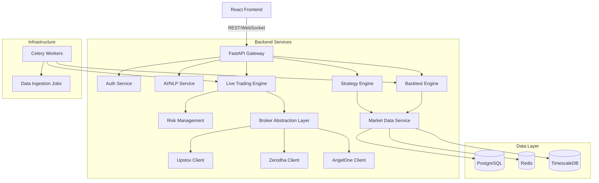

# AlphaPrime Architecture Design

## 1. High-Level Overview

The AlphaPrime platform is designed as a modular, event-driven microservices-like architecture (monolith with clear boundaries) to support high-frequency trading, AI-driven decision making, and multi-broker execution.

## 2. Core Modules

### A. Authentication & User Management
- **Tech**: JWT, OAuth2, Password Hashing (bcrypt).
- **Features**: Role-based access (Admin, User), Broker credential management.

### B. Broker Integration Layer
- **Goal**: Decouple trading logic from specific broker APIs.
- **Interface**: `BrokerService` (Abstract Base Class).
  - `place_order(symbol, qty, side, type, ...)`
  - `cancel_order(order_id)`
  - `get_positions()`
  - `get_holdings()`
  - `get_market_data(symbol, interval, from, to)`
- **Implementations**: `UpstoxClient`, `ZerodhaClient`, `AngelOneClient`.

### C. Market Data & Historical Data Service
- **Sources**: Broker APIs, External Providers.
- **Storage**:
  - `stock_data`: TimescaleDB hypertable for OHLCV (1min, 5min, Daily).
  - `instruments`: Master list of symbols.
- **Jobs**:
  - Real-time ingestion (WebSocket/Polling).
  - Historical backfill (Daily jobs).

### D. Strategy Engine
- **Design**: Pluggable Strategy Pattern.
- **Registry**: Dynamic loading of strategy classes.
- **Interface**:
  - `generate_signal(market_data) -> Signal`
- **Types**:
  - `MomentumStrategy`
  - `MeanReversionStrategy`
  - `MLStrategy` (LightGBM/XGBoost/LSTM)

### E. Backtesting Engine
- **Tech**: VectorBT Pro (for speed), Custom Event-Loop (for detail).
- **Features**:
  - Equity Curve, Sharpe, Drawdown, Win Rate.
  - Parameter Optimization (Walk-forward).
  - Transaction cost simulation.

### F. Live Trading & Execution Engine
- **Components**:
  - `SignalGenerator`: Runs strategies on live data.
  - `OrderManager`: Handles order lifecycle (Placement, Updates, Cancellation).
  - `ExecutionAlgo`: Smart routing (TWAP, VWAP) - *Future*.
- **Safety**: Auto-square off at 3:15 PM.

### G. Risk Management Module
- **Checks**:
  - Max Daily Loss (Hard Stop).
  - Max Position Size.
  - Max Open Positions.
  - Capital Allocation per Strategy.

### H. NLP / AI Command Layer
- **Tech**: Gemini 1.5 Flash / Pro.
- **Function**: Natural Language Understanding (NLU) -> Structured Command (JSON).
- **Commands**:
  - "Start bot on Nifty 50" -> `{"action": "start_bot", "universe": "NIFTY50"}`
  - "Analyze Reliance" -> `{"action": "analyze", "symbol": "RELIANCE"}`

## 3. Database Schema (PostgreSQL)

### Users & Auth
- `users`: id, email, password_hash, role
- `broker_credentials`: user_id, broker_name, api_key, secret, tokens

### Trading Core
- `strategies`: id, name, type, config_schema
- `strategy_configs`: user_id, strategy_id, parameters (JSON)
- `orders`: id, user_id, symbol, side, qty, price, status, broker_order_id
- `positions`: user_id, symbol, qty, avg_price, pnl
- `executions`: order_id, price, qty, timestamp

### Data
- `stock_data`: symbol, timestamp, open, high, low, close, volume (TimescaleDB)
- `instruments`: symbol, name, exchange_token, lot_size

### Analytics
- `backtest_jobs`: id, strategy_config_id, status, result_summary (JSON)
- `backtest_results`: job_id, timestamp, equity, drawdown
- `logs`: level, component, message, timestamp

## 4. Frontend Architecture (React)

- **Layout**: Dashboard Layout with Sidebar & Topbar.
- **State Management**: React Query (Server State), Zustand (Client State).
- **Modules**:
  - `auth/`: Login, Signup, Profile.
  - `dashboard/`: Widgets, PnL Graph, Active Bots.
  - `market/`: Watchlist, Charts (TradingView/Recharts), Scanner.
  - `strategies/`: Config Form, Backtest Runner, Results View.
  - `trading/`: Order Entry, Positions, Orders Table.
  - `ai/`: Chat Interface, Command History.

## 5. Implementation Roadmap (MVP Slice)

1.  **Broker Abstraction**: Refactor `UpstoxClient` into `BrokerService` interface.
2.  **Strategy Interface**: Define `BaseStrategy` and implement `SimpleMomentum`.
3.  **Data Layer**: Ensure `stock_data` can handle multi-timeframe queries efficiently.
4.  **AI Command**: Connect `routers/ai.py` to actual execution logic (not just returning JSON).
5.  **Frontend**: Build "Strategies" and "AI Console" pages.
